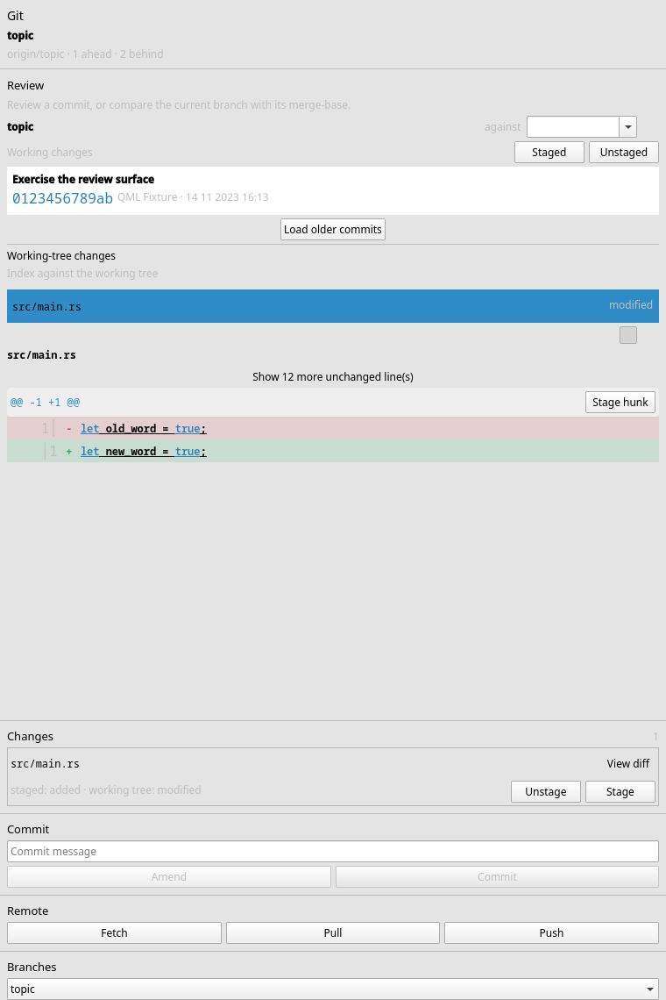
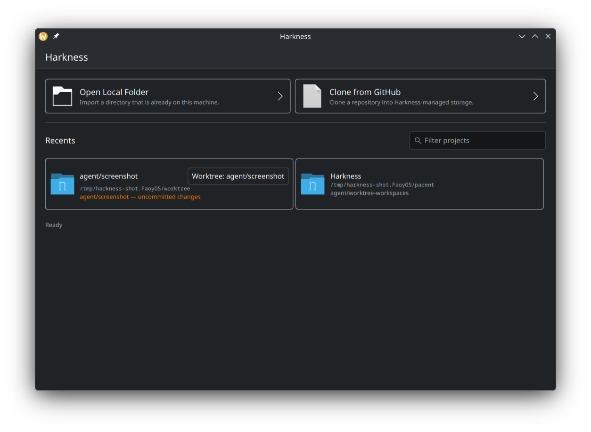
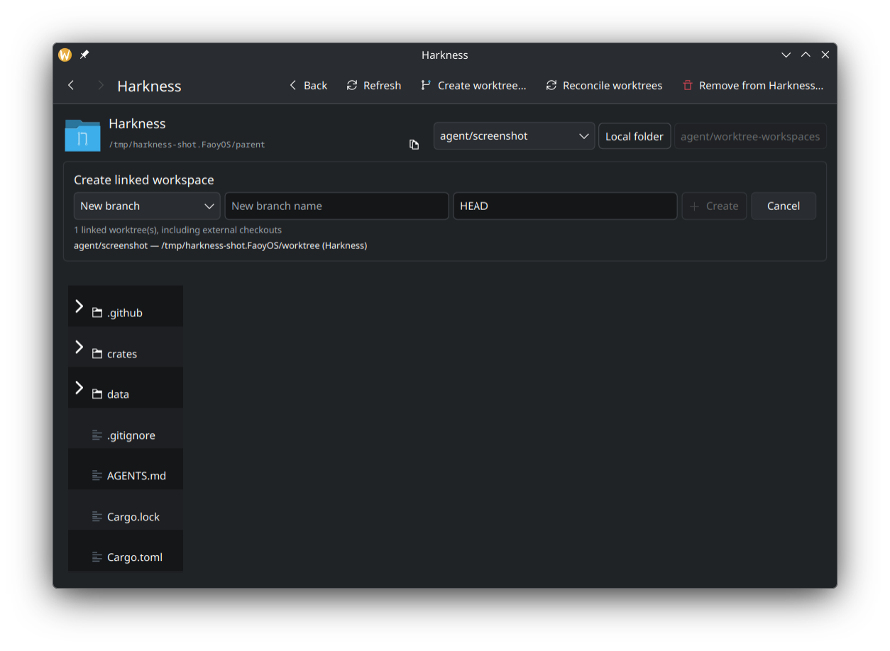

# Harkness

Harkness is an early native AI-harness scaffold. Its Rust core maintains a local
project catalog and can safely clone GitHub repositories through the system Git
executable, preserving the user's existing SSH and HTTPS credential setup. Its
core also provides cancellable branch listing and locked, typed create,
checkout, rename, delete, and upstream-management operations. The same locked
service stages explicit paths, stages a whole working tree, unstages safely
before or after the first commit, and creates guarded commits and amendments.
The KDE Kirigami application opens on a project launcher — Recents, local
folder import, and validated GitHub cloning with progress and cancellation —
and opens each project into a shell showing its Git identity next to a lazy,
read-only file tree that never descends into `.git` or through directory
symlinks. A worker-backed branch picker switches existing local branches
without blocking the UI and identifies branches held by another worktree before
selection.
Managed clones are deleted only after a confirmation naming the checkout;
local projects are simply forgotten, leaving their files untouched. Git
repositories can create, list, reconcile, and remove first-class linked
workspaces on new branches, existing branches, or detached commits.

Harkness requires Git 2.36 or newer. Worktree discovery uses the unambiguous
NUL-delimited `git worktree list --porcelain -z` format introduced in that
release.

## Fedora development setup

On Fedora 44, install Rust and the Qt 6 / KDE Frameworks 6 development tools:

```sh
sudo dnf install cargo rust gcc-c++ cmake extra-cmake-modules \
    qt6-qtbase-devel qt6-qtdeclarative-devel qt6-qttools-devel \
    kf6-kirigami-devel qqc2-desktop-style
```

The GUI build needs Qt's `qmake` on `PATH`. If more than one Qt installation is
present, set `QMAKE` to the Qt 6 executable before running Cargo.

## Develop with Cargo

```sh
cargo run -p harkness-cli
cargo run -p harkness-gui
cargo test --workspace
cargo fmt --check
cargo clippy --workspace --all-targets
```

The CLI exposes the project catalog with a versioned machine-readable contract
and stable exit codes suitable for agents. Commands that act on one project
accept `--project <SELECTOR>` after the command name. A selector may be a full
ID, an ID prefix of at least eight characters, an absolute or dot-relative
path, or a display name. Bare words are always names, so their meaning does not
change with the current directory. When `--project` is omitted, Harkness walks
upward from the current directory and selects the deepest catalogued root, so
commands run naturally from a repository or linked worktree.

```sh
harkness --json project list
harkness --json project list --no-status
harkness project show --project <selector>
harkness project resolve <selector>
harkness project import <path>
harkness project clone <github-remote>
harkness project reconcile
harkness project forget --project <selector>
harkness project delete --project <selector> --yes

harkness --json git status [--paths] [--project <selector>]
harkness --json git log [HEAD | <old>..<new> | <base>...<branch>] [--limit <count>] [--cursor <token>] [--project <selector>]
harkness --json git diff [--staged | --unstaged | --commit <revision> [--parent <revision>] | --revisions <old>..<new> | --worktree <revision> | --branch <base>...<branch>] [--context-lines <lines>] [--expand-context <lines> | --full-file-context] [--context-from <path|->] [--intra-line] [--max-file-size <bytes>] [--max-total-bytes <bytes>] [--max-files <count>] [--] [<path>...] [--project <selector>]
harkness --json git fetch [--remote <name>] [--prune] [--project <selector>]
harkness --json git pull [--ff-only | --rebase | --merge] [--project <selector>]
harkness --json git push [--set-upstream] [--allow-default-branch] [--force-with-lease] [--project <selector>]
harkness --json git branch list [--all] [--project <selector>]
harkness --json git branch create <name> [--from <ref>] [--checkout] [--project <selector>]
harkness --json git branch checkout <name> [--project <selector>]
harkness --json git branch delete <name> [--force] [--project <selector>]
harkness --json git stage (<path>... | --all | --hunk <selection-flags> | --hunk-selection <path|->) [--project <selector>]
harkness --json git unstage (<path>... | --hunk <selection-flags> | --hunk-selection <path|->) [--project <selector>]
harkness --json git commit --message <message> [--amend] [--allow-empty] [--project <selector>]

harkness --json worktree list [--project <parent-selector>]
harkness --json worktree add --branch <name> [--from <ref>] [--project <parent-selector>]
harkness --json worktree add --branch <name> --existing [--project <parent-selector>]
harkness --json worktree add --branch <revision> --detach [--project <parent-selector>]
harkness --json worktree remove [--force] [--project <worktree-selector>]
harkness --json worktree move <destination> [--project <worktree-selector>]
harkness --json worktree lock --reason <text> [--replace] [--project <worktree-selector>]
harkness --json worktree unlock [--project <worktree-selector>]
harkness --json worktree prune [--project <parent-selector>]

harkness --json contract
```

Operational `--json` commands write exactly one success or error envelope to
standard output. Every envelope starts with `"v": 1` and has a `type` of
`success`, `error`, or `progress`; success and error results also carry `ok`.
Clone, fetch, pull, and push progress remains on standard error as one versioned
JSON object per line, keeping standard output parseable. Help and version are
deliberately plain text even when `--json` is present. `harkness --json contract`
reports the current envelope version, exit codes, streams, and complete
error-kind namespaces. It also reports `exit_code_by_kind`, which maps every
CLI, project, and Git error kind to the exit code it returns, so a caller reads
the classification instead of hardcoding it.

`git log` accepts one Git-style range: `REVISION` walks everything reachable
from it, `OLD..NEW` walks commits reachable from `NEW` but not `OLD`, and
`BASE...BRANCH` walks only the branch commits after the merge-base. A page is
bounded by `--limit` (50 by default and at most 1,000) and returns an opaque
`next_cursor`; pass that token back with the same range to continue without an
offset, even if a new commit lands at the tip. The `git_log` payload carries
newest-first `commit` records with every parent ID, author and committer time,
and byte-exact names, emails, summaries, and messages. Each byte field names
its `utf8` or `base64` encoding. Missing and ambiguous revisions are distinct
error kinds and both exit 4.

`git diff` returns a `git_diff` payload with one structured `files` array.
Without a revision target it returns staged records first and unstaged records
second; `--staged` or `--unstaged` narrows it to one side of the index. Both
sides are read from a single index snapshot, so a combined response always
describes one moment. `--commit` compares a commit with its first or explicitly
named parent, `--revisions OLD..NEW` compares two trees, `--worktree` compares a
revision with the current index and working tree, and
`--branch BASE...BRANCH` compares the branch with its merge-base so base-only
changes do not leak into review. The payload names every requested comparison
in `targets`; revision file records repeat their stable `target` kind and echo
the comparison in `target_details` so a narrowed record stays self-describing.

Each file carries its blob IDs, paths, modes, sizes, and hunks. Every hunk line
names its `content_encoding`: valid UTF-8 is emitted directly, while arbitrary
bytes use Base64, so consumers can reconstruct the exact content. Paths
additionally carry `old_path_base64` and `new_path_base64` holding their exact
bytes, because a name that is not UTF-8 cannot be spelled in the lossy
`old_path` and `new_path` strings.

Inspection is total: a file always appears in the listing, and when it carries
no hunks the `omission` object says why. The reasons are `file_too_large`,
`unmerged` for an unresolved merge conflict, `content_budget_exhausted`,
`file_budget_exhausted`, and `unrepresentable` for a record Git described in a
shape the model cannot carry. One such file never fails the whole command.
`--max-file-size` bounds a single file, while `--max-total-bytes` and
`--max-files` bound the whole response; `--context-lines` is capped at 100
because context multiplies every hunk in every file. Binary files remain
summary records with `binary: true`.

Context retrieval does not widen and recompute the diff. `--expand-context N`
adds a `hunk_context` to every returned hunk, loading `N` additional lines on
both sides from the recorded immutable blob IDs (or from a hash-guarded
working-tree side). `--full-file-context` adds complete old and new
`file_context` responses to each eligible file. The same file and total-byte
bounds apply across these responses, and a bound produces a named omission in
the success payload rather than partial content. To expand an earlier response
without recomputing even the base diff, narrow that response's `files` and
`hunks` arrays and pass it through `--context-from <path|->`; immutable sides
still resolve by their recorded blob IDs, while a changed working-tree side is
refused as stale. For example:

```sh
harkness --json git diff --staged --project <selector> \
  | jq '{files: [.data.files[] | select(.new_path == "src/main.rs")
                               | .hunks |= [.[0]]]}' \
  | harkness --json git diff --expand-context 20 --context-from - \
      --project <selector>
```

`--intra-line` opts into
paired deletion/addition indexes and half-open byte ranges. Those keys are
absent without the flag; pathological lines or pairings retain ordinary line
marks and name `line_too_long` or `pairing_too_large` on the hunk.

There are two ways to stage or unstage below path granularity, and both are
refused before any mutation if an identity or coordinate has gone stale: the
diff is recomputed under the repository lock, and a mismatch exits 3 with the
index untouched.

For a single hunk, pass `--hunk` with the selected file's `--old-path` and/or
`--new-path`, `--old-blob-id`, `--new-blob-id`, and `--context-lines`, plus the
hunk's `--old-start`, `--old-lines`, `--new-start`, and `--new-lines`. Use
`--old-path-base64` or `--new-path-base64` instead when the diff marked the path
lossy.

For more than one hunk, pass `--hunk-selection` a JSON document, or `-` to read
it from standard input. The document is the `git diff` response with the hunks
you do not want removed, so no reshaping is needed:

```sh
harkness --json git diff --unstaged --project <selector> \
  | jq '{files: [.data.files[] | select(.new_path == "src/main.rs")
                               | .hunks |= [.[0], .[2]]]}' \
  | harkness --json git stage --hunk-selection - --project <selector>
```

A flat `{"selections": [...]}` form is also accepted for callers that assemble
coordinates themselves. Prefer a document over repeated single-hunk calls:
the whole batch is one atomic index write, whereas staging one hunk rewrites
the index and shifts the blob IDs of every other selection taken from the same
diff, so a second single-hunk call would be correctly refused as stale.

`git stage` consumes unstaged records and `git unstage` consumes staged ones, so
narrow the diff before piping it; a record carrying the other side's `target` is
refused as a usage error rather than reported as stale. Two selections that
resolve to the same hunk are deduplicated, and the reported `hunks` count is
what reached the index rather than what was supplied. Two selections whose lines
overlap cannot be expressed as one patch and are refused with
`overlapping_hunk_selection` before the index is opened.

Whole-path staging and unstaging keep their existing syntax. A path that begins
with a hyphen goes after a `--` separator, as Git itself requires.

Project JSON uses an explicit CLI projection rather than the catalog's storage
serializer. `last_opened` is RFC 3339, source-specific optional fields are
always present with `null` when inapplicable, and `git` has a fixed documented
shape. Paths use a lossy wire conversion when the platform path is not UTF-8
and mark the containing record with `path_is_lossy: true`. A `--no-status`
listing avoids filesystem and Git probes and reports
`status_checked: false`, `available: null`, and `git: null` rather than
pretending the project is missing. `HARKNESS_DATA_DIR` and `--data-dir <path>`
select an isolated catalog, with the explicit flag taking precedence. Run
`harkness --help` for the exit-code contract and complete command help.

Removing a worktree preserves its branch, allowing `--existing` to reuse it.
Ordinary removal refuses uncommitted files; discarding them requires the
explicit `--force` override. Worktree pruning removes only missing
Harkness-owned rows and their exact Git administrative records. It never
performs a repository-wide prune or adopts or removes external worktrees.

A worktree lock records a mandatory reason and protects the checkout from
removal, relocation, and pruning; `--force` does not override it, so clearing
protection always takes an explicit `worktree unlock`. Git trims the stored
reason and `worktree list` reports it as `lock_reason`, which is `null` when a
lock records no reason at all. Locking an already-locked worktree is refused
rather than silently replaced; `--replace` supersedes an existing reason
without leaving the checkout unprotected in between. Lock changes apply only to
Harkness-created checkouts, so a catalog row aimed at a foreign worktree is
refused instead of having its protection altered.

Ctrl-C cooperatively cancels a running clone or Git operation, cleans partial
storage, and exits 130. A non-cooperative kill cannot run cleanup, so `project
reconcile` safely removes UUID-named managed directories with no catalog row.
Per-import locks make it skip live clones, and unrelated files or directories
under managed storage are left untouched.

The GUI opens a Kirigami window on the project launcher backed by the Rust
`HarknessBackend` and `FileTreeModel` QML objects. Its project shell exposes the
same creation modes, live linked-worktree inventory, selective reconciliation,
and a second confirmation before dirty files can be discarded. Selecting a
changed path loads only that path's staged and unstaged content, marks added
and removed lines, and stages or unstages one stale-safe hunk at a time. Binary,
byte-bounded, and line-bounded content stays visible as a named summary instead
of eagerly creating an unbounded number of QML delegates. Managed worktree rows
expose move, lock, and unlock while showing the stored lock reason inline.

### Git review UI



### Worktree UI





## Install locally for Plasma

The thin CMake wrapper builds the locked Cargo workspace and installs both
executables and the desktop file. A user-local installation can be made with:

```sh
cmake -S . -B build -DCMAKE_BUILD_TYPE=Release \
    -DCMAKE_INSTALL_PREFIX="$HOME/.local"
cmake --build build
cmake --install build
```

After Plasma refreshes its application database, Harkness appears in the
Development category. Run `harkness-gui` directly to launch it without the menu.
