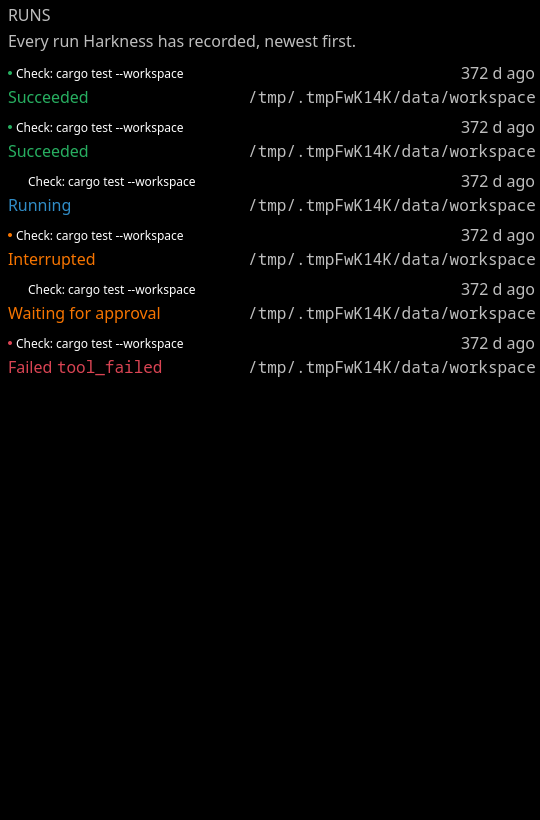
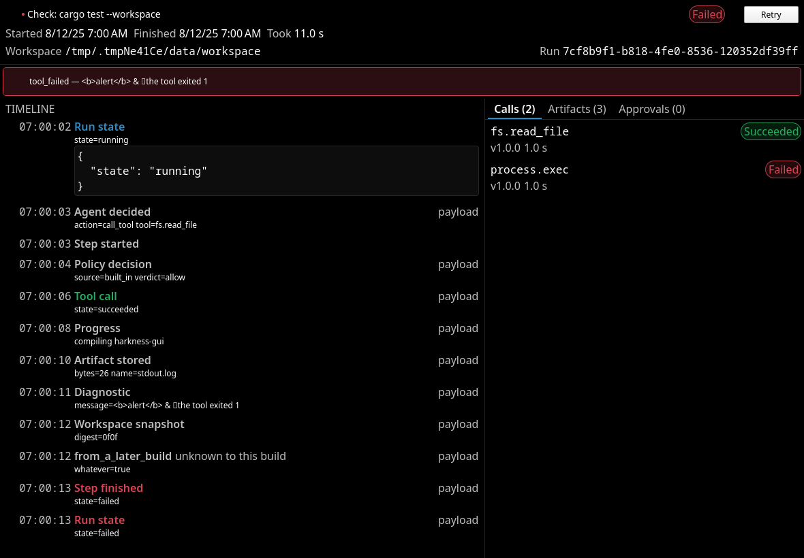
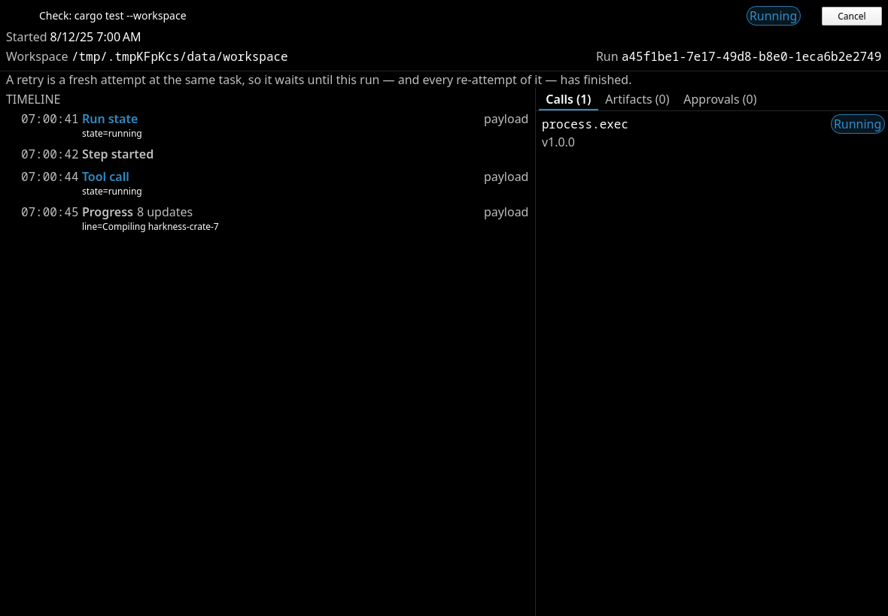
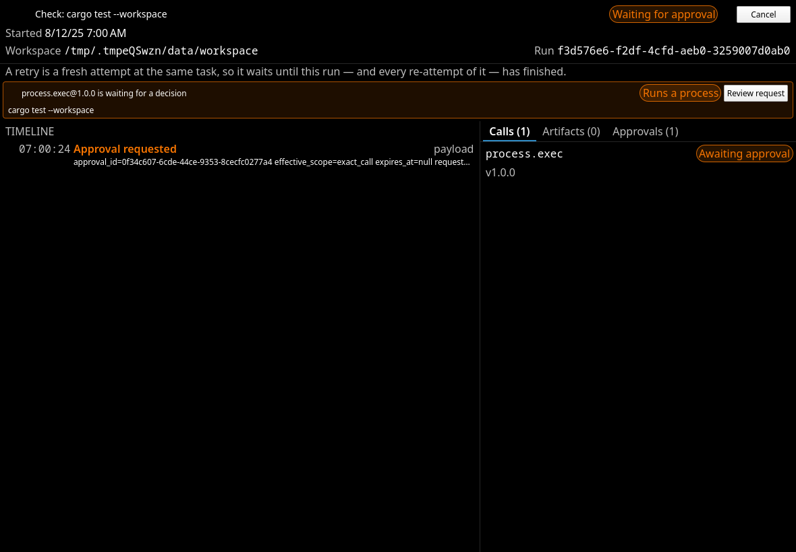
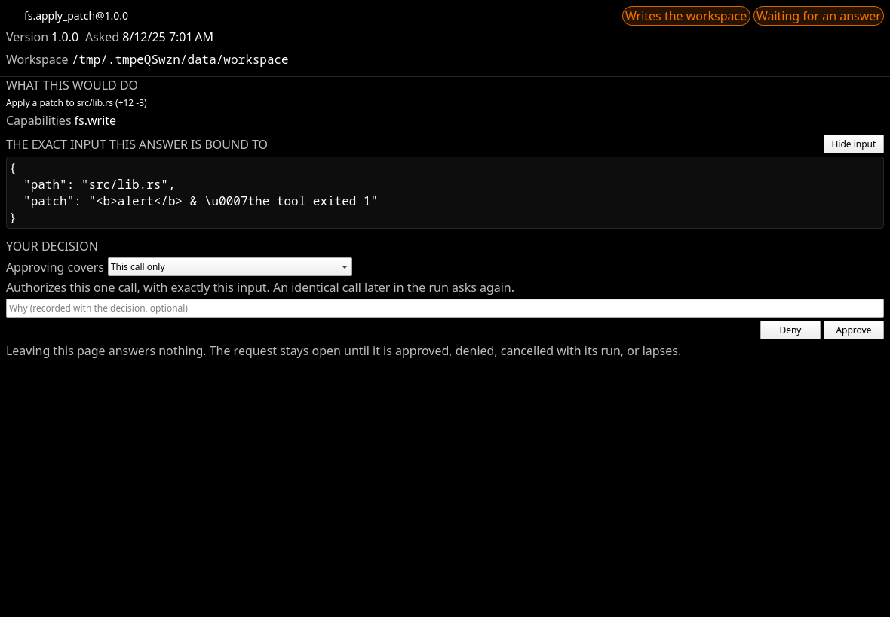
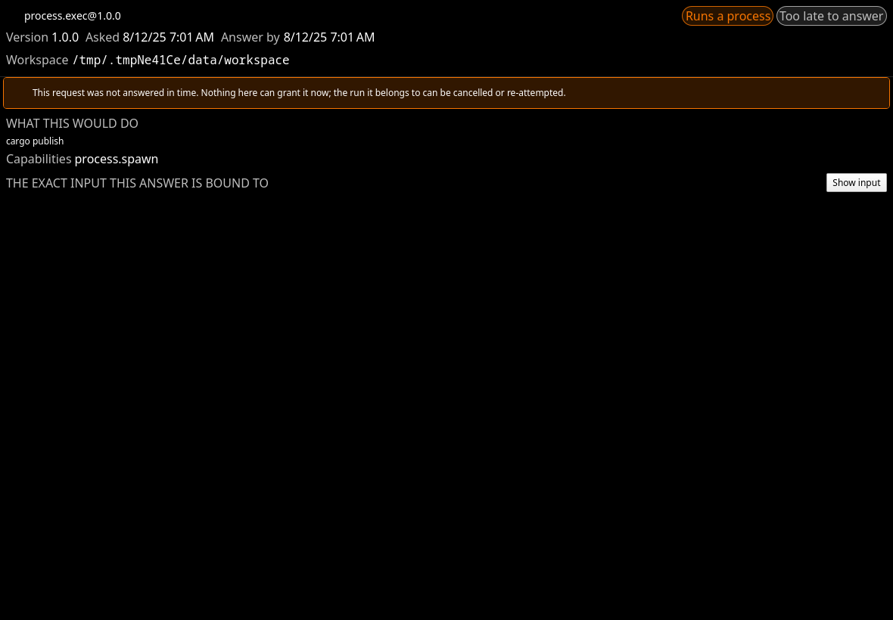
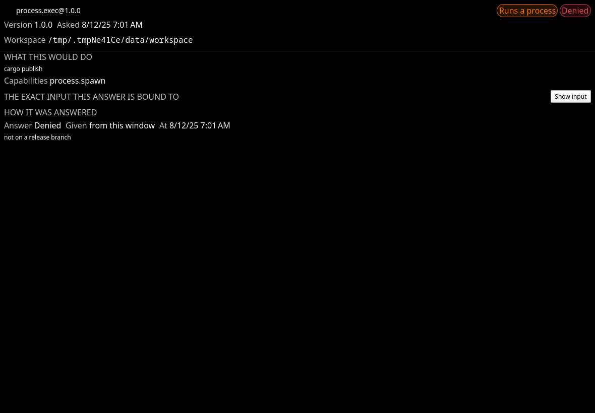
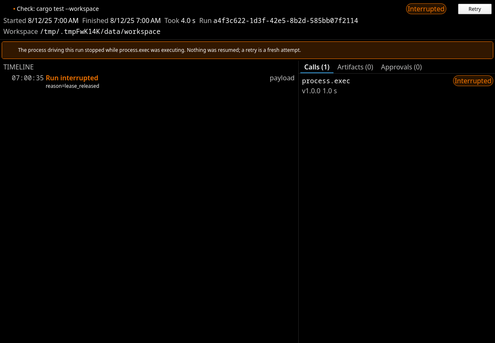
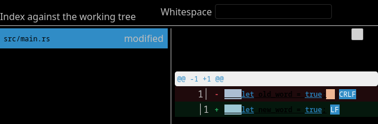
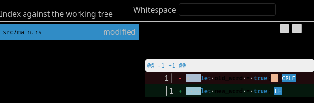

# Harkness

Harkness is an early native AI-harness scaffold. Its Rust catalog core and
dedicated Git integration crate maintain a local project catalog and safely
clone GitHub repositories through the system Git executable, preserving the
user's existing SSH and HTTPS credential setup. The Git layer also provides
cancellable branch listing and locked, typed create,
checkout, rename, delete, and upstream-management operations. The same locked
service stages explicit paths, stages a whole working tree, unstages safely
before or after the first commit, and creates guarded commits and amendments.
The KDE Kirigami application opens on a project launcher — Recents, local
folder import, and validated GitHub cloning with progress and cancellation —
and opens each project into a shell showing its Git identity next to a lazy,
read-only file tree that never descends into `.git` or through directory
symlinks. A worker-backed branch picker switches existing local branches
without blocking the UI and identifies branches held by another worktree before
selection.
Managed clones are deleted only after a confirmation naming the checkout;
local projects are simply forgotten, leaving their files untouched. Git
repositories can create, list, reconcile, and remove first-class linked
workspaces on new branches, existing branches, or detached commits.

Harkness requires Git 2.36 or newer. Worktree discovery uses the unambiguous
NUL-delimited `git worktree list --porcelain -z` format introduced in that
release.

## Fedora development setup

On Fedora 44, install Rust and the Qt 6 / KDE Frameworks 6 development tools:

```sh
sudo dnf install cargo rust gcc-c++ cmake extra-cmake-modules \
    qt6-qtbase-devel qt6-qtdeclarative-devel qt6-qttools-devel \
    kf6-kirigami-devel qqc2-desktop-style
```

The GUI build needs Qt's `qmake` on `PATH`. If more than one Qt installation is
present, set `QMAKE` to the Qt 6 executable before running Cargo.

## Develop with Cargo

```sh
cargo run -p harkness-cli
cargo run -p harkness-gui
cargo test --workspace
cargo fmt --check
cargo clippy --workspace --all-targets
```

### Live QML reloading

`cargo run -p harkness-gui` from the working copy reads its QML from `crates/harkness-gui/qml`
instead of from the resources compiled into the binary, and rebuilds the window whenever a file
there is saved. The project that was open is reopened after the reload, and a file saved
half-written leaves the running window up with the parse error on stderr. An installed build has
no working copy beside it, so it is unaffected; `HARKNESS_QML_HOT_RELOAD=0` turns it off, and
`HARKNESS_QML_SOURCE_DIR` points it at a different directory.

Rust edits still need a rebuild. `sh scripts/dev-gui.sh` runs the GUI under a file watcher that
restarts it when they change, leaving QML edits to reload in place.

The CLI exposes the project catalog with a versioned machine-readable contract
and stable exit codes suitable for agents. Commands that act on one project
accept `--project <SELECTOR>` after the command name. A selector may be a full
ID, an ID prefix of at least eight characters, an absolute or dot-relative
path, or a display name. Bare words are always names, so their meaning does not
change with the current directory. When `--project` is omitted, Harkness walks
upward from the current directory and selects the deepest catalogued root, so
commands run naturally from a repository or linked worktree.

```sh
harkness --json project list
harkness --json project list --no-status
harkness project show --project <selector>
harkness project resolve <selector>
harkness project import <path>
harkness project clone <github-remote>
harkness project reconcile
harkness project forget --project <selector>
harkness project delete --project <selector> --yes

harkness --json git status [--paths] [--project <selector>]
harkness --json git log [HEAD | <old>..<new> | <base>...<branch>] [--limit <count>] [--cursor <token>] [--project <selector>]
harkness --json git diff [--staged | --unstaged | --commit <revision> [--parent <revision>] | --revisions <old>..<new> | --worktree <revision> | --branch <base>...<branch>] [--context-lines <lines>] [--expand-context <lines> | --full-file-context] [--context-from <path|->] [--intra-line] [--max-file-size <bytes>] [--max-total-bytes <bytes>] [--max-files <count>] [--] [<path>...] [--project <selector>]
harkness --json git fetch [--remote <name>] [--prune] [--project <selector>]
harkness --json git pull [--ff-only | --rebase | --merge] [--project <selector>]
harkness --json git push [--set-upstream] [--allow-default-branch] [--force-with-lease] [--project <selector>]
harkness --json git branch list [--all] [--project <selector>]
harkness --json git branch create <name> [--from <ref>] [--checkout] [--project <selector>]
harkness --json git branch checkout <name> [--project <selector>]
harkness --json git branch delete <name> [--force] [--project <selector>]
harkness --json git stage (<path>... | --all | --hunk <selection-flags> | --hunk-selection <path|-> | --line-selection <path|->) [--project <selector>]
harkness --json git unstage (<path>... | --hunk <selection-flags> | --hunk-selection <path|-> | --line-selection <path|->) [--project <selector>]
harkness --json git discard (--from <index|head> | --delete-untracked) (<path>... | --hunk <selection-flags> | --hunk-selection <path|-> | --line-selection <path|->) [--yes] [--project <selector>]
harkness --json git commit --message <message> [--amend] [--allow-empty] [--project <selector>]

harkness --json worktree list [--project <parent-selector>]
harkness --json worktree add --branch <name> [--from <ref>] [--project <parent-selector>]
harkness --json worktree add --branch <name> --existing [--project <parent-selector>]
harkness --json worktree add --branch <revision> --detach [--project <parent-selector>]
harkness --json worktree remove [--force] [--project <worktree-selector>]
harkness --json worktree move <destination> [--project <worktree-selector>]
harkness --json worktree lock --reason <text> [--replace] [--project <worktree-selector>]
harkness --json worktree unlock [--project <worktree-selector>]
harkness --json worktree prune [--project <parent-selector>]

harkness --json editor show
harkness --json editor presets
harkness --json editor set --preset <kate|code|zed>
harkness --json editor set -- <executable> <argument>... {file}
harkness --json editor clear
harkness --json editor open <path> [--line <line>] [--column <column>] [--project <selector>]

harkness --json run list [--limit <count>] [--cursor <token>]
harkness --json run show <run-id> [--limit <count>] [--cursor <seq>] [--order <oldest|newest>]
harkness --json run cancel <run-id>
harkness --json run retry <run-id> --scenario <name> [--interactive] [--trust-workspace]

harkness --json approvals list [--all] [--limit <count>] [--cursor <token>]
harkness --json approvals approve <approval-id> [--scope <call|tool-this-run|capability-this-run>] [--reason <text>]
harkness --json approvals deny <approval-id> [--reason <text>]

harkness --json tool list
harkness --json tool describe <tool-id> [--tool-version <semver>]
harkness --json tool invoke <tool-id> --input <json|-> [--tool-version <semver>] [--project <selector>] [--interactive] [--trust-workspace]

harkness --json agent scenarios
harkness --json agent run --scenario <name> [--project <selector>] [--interactive] [--trust-workspace]

harkness --json contract
```

Operational `--json` commands write exactly one success or error envelope to
standard output. Every envelope starts with `"v": 1` and has a `type` of
`success`, `error`, or `progress`; success and error results also carry `ok`.
Clone, fetch, pull, and push progress remains on standard error as one versioned
JSON object per line, keeping standard output parseable. Help and version are
deliberately plain text even when `--json` is present. `harkness --json contract`
reports the current envelope version, exit codes, streams, and complete
error-kind namespaces. It also reports `exit_code_by_kind`, which maps every
CLI, project, Git, editor, runtime, and tool error kind to the exit code it
returns, so a caller reads the classification instead of hardcoding it. A kind
that appears in two namespaces — `not_found`, `cancelled`, `timed_out` — reports
the same exit code in both.

The `run`, `approvals`, `tool`, and `agent` families expose the same runtime the
application uses, with no business logic of their own. `tool invoke` is the
path that proves a tool needs no model: it resolves the tool, validates the
input against its published schema, evaluates policy, records the call, and
executes it, all through the ordinary pipeline. It is not a bypass, and the
recorded call is readable afterwards with `run show`.

Approval requests are **denied by default**. Anything above `observe` requires
an approval even in a trusted workspace, and a headless invocation has nobody to
ask, so it refuses with kind `approval_required_noninteractive` and exit 3 rather
than proceeding. `--interactive` asks instead: the question goes to standard
error — as a progress envelope under `--json`, so standard output stays exactly
one result — and one line comes back on standard input. Closing standard input
is a denial, and Ctrl-C at a prompt cancels the run and exits 130.

The answers are `approve`, `deny`, and `show-input`. A bare `approve` authorizes
**that call and nothing else**, matching what `approvals approve --scope call`
defaults to; `approve-tool` and `approve-capability` widen it for the rest of the
run and have to be typed in full. Every answer is still narrowed against what the
stored request permits, so a remote-write or destructive request — already
downgraded to a single call when it was created — cannot be widened at all.
Because `--input -` also reads standard input to end of file, it cannot be
combined with `--interactive`; the pair is refused as a usage error rather than
silently ending in a denial.

`run list` pages newest-first with an opaque `next_cursor`, exactly as `git log`
does. A run's timeline pages separately, by the sequence number `run show`
returns as its own `next_cursor`, in either direction. `agent run` and `tool
invoke` stream the run's events to standard error as they are recorded, one
progress envelope per event carrying the persisted record, and print one bounded
result envelope on standard output; the whole timeline is read back with
`run show`.

`run cancel` and `approvals approve|deny` reach a *live* worker: the run's
cancellation token and the thread parked on an approval both live in the process
that started the run, and a decision persisted anywhere else would never wake
either. A one-shot command invocation drives at most the run it started itself,
so in practice these two verbs report `run_not_active` or `approval_not_active`
— both exit 3 — and answering happens where the run is: at an `--interactive`
prompt, or in the application, which holds its coordinator open. They are kept as
commands because the refusal is the honest answer and because the application
uses the same coordinator calls.

Retrying needs no live worker. `run retry` starts a fresh attempt at the same
task recording `retry_of`, taking the workspace from the run being re-attempted
rather than from `--project` or the current directory — a recorded task already
names its workspace, and naming a second one could only name a different one. It
reports `workspace_may_be_modified` when the earlier attempt started work that
could write. Nothing is resumed and no approval carries over.

Every run also requires a positive workspace trust decision, recorded once with
`--trust-workspace` after reviewing the project root, exactly as `check run`
requires one. Without it the command refuses before a run is recorded at all —
an untrusted workspace denies everything above `observe` and asks about
everything below it, so the alternative is a run that is persisted and then
refused.

Editor commands store an argv template, not a shell command. Each argument is
persisted separately and Harkness substitutes `{file}`, `{line}`, and
`{column}` without invoking a shell, so paths containing spaces, metacharacters,
or platform-native non-Unicode units stay one literal argument. `{file}` is
required and line and column values are one-based. `editor presets` exposes
templates for Kate, VS Code, and Zed; any executable can be configured with
`editor set --`.

An `editor open` launched from the CLI inherits the terminal. Without a saved
configuration it tries `$VISUAL`, then `$EDITOR`, and finally the platform
desktop opener. The GUI deliberately ignores terminal-editor environment
variables and uses only a saved configuration or the desktop opener, with
standard streams detached. Both front ends return as soon as the child starts;
Harkness reaps the child in the background and never holds a project catalog or
repository lock while the editor is running. Paths must be relative to the
selected project, and the GUI refuses to launch when the corresponding
working-tree file is absent. A staged or historical review also warns that its
pinned content may differ from the file the editor opens.

`git log` accepts one Git-style range: `REVISION` walks everything reachable
from it, `OLD..NEW` walks commits reachable from `NEW` but not `OLD`, and
`BASE...BRANCH` walks only the branch commits after the merge-base. A page is
bounded by `--limit` (50 by default and at most 1,000) and returns an opaque
`next_cursor`; pass that token back with the same range to continue without an
offset, even if a new commit lands at the tip. The `git_log` payload carries
newest-first `commit` records with every parent ID, author and committer time,
and byte-exact names, emails, summaries, and messages. Each byte field names
its `utf8` or `base64` encoding. Missing and ambiguous revisions are distinct
error kinds and both exit 4.

`git diff` returns a `git_diff` payload with one structured `files` array.
Without a revision target it returns staged records first and unstaged records
second; `--staged` or `--unstaged` narrows it to one side of the index. Both
sides are read from a single index snapshot, so a combined response always
describes one moment. `--commit` compares a commit with its first or explicitly
named parent, `--revisions OLD..NEW` compares two trees, `--worktree` compares a
revision with the current index and working tree, and
`--branch BASE...BRANCH` compares the branch with its merge-base so base-only
changes do not leak into review. The payload names every requested comparison
in `targets`; revision file records repeat their stable `target` kind and echo
the comparison in `target_details` so a narrowed record stays self-describing.

Each file carries its blob IDs, paths, modes, sizes, and hunks. Every hunk line
names its `content_encoding`: valid UTF-8 is emitted directly, while arbitrary
bytes use Base64, so consumers can reconstruct the exact content. Paths
additionally carry `old_path_base64` and `new_path_base64` holding their exact
bytes, because a name that is not UTF-8 cannot be spelled in the lossy
`old_path` and `new_path` strings.

Inspection is total: a file always appears in the listing, and when it carries
no hunks the `omission` object says why. The reasons are `file_too_large`,
`unmerged` for an unresolved merge conflict, `content_budget_exhausted`,
`file_budget_exhausted`, and `unrepresentable` for a record Git described in a
shape the model cannot carry. One such file never fails the whole command.
`--max-file-size` bounds a single file, while `--max-total-bytes` and
`--max-files` bound the whole response; `--context-lines` is capped at 100
because context multiplies every hunk in every file. Binary files remain
summary records with `binary: true`.

Context retrieval does not widen and recompute the diff. `--expand-context N`
adds a `hunk_context` to every returned hunk, loading `N` additional lines on
both sides from the recorded immutable blob IDs (or from a hash-guarded
working-tree side). `--full-file-context` adds complete old and new
`file_context` responses to each eligible file. The same per-file and total-byte
bounds apply across these responses, and a bound produces a named omission in
the success payload rather than partial content. To expand an earlier response
without recomputing even the base diff, narrow that response's `files` and
`hunks` arrays and pass it through `--context-from <path|->`; immutable sides
still resolve by their recorded blob IDs, while a changed working-tree side is
refused as stale. A submodule entry names a commit rather than a file blob, so
its context side is `null` while any blob-backed side remains available. The
replayed input already fixes the original diff width and file set, so
`--context-lines` and `--max-files` are rejected in that mode. For example:

```sh
harkness --json git diff --staged --project <selector> \
  | jq '{files: [.data.files[] | select(.new_path == "src/main.rs")
                               | .hunks |= [.[0]]]}' \
  | harkness --json git diff --expand-context 20 --context-from - \
      --project <selector>
```

`--intra-line` opts into
paired deletion/addition indexes and half-open byte ranges. Those keys are
absent without the flag; pathological lines or pairings retain ordinary line
marks and name `line_too_long` or `pairing_too_large` on the hunk.

There are three ways to stage or unstage below path granularity, and all are
refused before any mutation if an identity or coordinate has gone stale: the
diff is recomputed under the repository lock, and a mismatch exits 3 with the
index untouched.

For a single hunk, pass `--hunk` with the selected file's `--old-path` and/or
`--new-path`, `--old-blob-id`, `--new-blob-id`, and `--context-lines`, plus the
hunk's `--old-start`, `--old-lines`, `--new-start`, and `--new-lines`. Use
`--old-path-base64` or `--new-path-base64` instead when the diff marked the path
lossy.

For more than one hunk, pass `--hunk-selection` a JSON document, or `-` to read
it from standard input. The document is the `git diff` response with the hunks
you do not want removed, so no reshaping is needed:

```sh
harkness --json git diff --unstaged --project <selector> \
  | jq '{files: [.data.files[] | select(.new_path == "src/main.rs")
                               | .hunks |= [.[0], .[2]]]}' \
  | harkness --json git stage --hunk-selection - --project <selector>
```

A flat `{"selections": [...]}` form is also accepted for callers that assemble
coordinates themselves. Prefer a document over repeated single-hunk calls:
the whole batch is one atomic index write, whereas staging one hunk rewrites
the index and shifts the blob IDs of every other selection taken from the same
diff, so a second single-hunk call would be correctly refused as stale.

For individual changed lines, pass `--line-selection` the same document shape
and narrow each retained hunk's `lines` array to the additions and deletions to
apply. Context and no-newline marker records may remain; they are ignored as
selection entries but are recomputed into the synthesized patch as needed. For
example, this stages the first added line in the first hunk:

```sh
harkness --json git diff --unstaged --project <selector> \
  | jq '{files: [.data.files[] | select(.new_path == "src/main.rs")
                               | .hunks |= [.[0]
                                   | .lines |= ([.[] | select(.kind != "addition")]
                                       + ([.[] | select(.kind == "addition")][0:1]))]]}' \
  | harkness --json git stage --line-selection - --project <selector>
```

The flat form uses the same file and hunk identity fields plus
`old_line_number` and `new_line_number`; exactly one line-number side is
present for an addition or deletion. Several lines from one fresh hunk are
merged and applied as one recounted patch hunk, and lines from several hunks of
one file are applied together with each later hunk shifted by what the earlier
ones actually contributed rather than by what the whole diff would have.

An unselected deletion is retained where the line that replaced it stood, so a
partial stage never reorders a file: staging only `two -> TWO` out of
`one/two/last -> one/TWO/LAST` leaves `one/TWO/last`. Where that retained line
is the last in a file with no final newline and a selected line would have to
follow it, no patch can express the result and the batch is refused with
`unrepresentable_line_selection`; select the rest of the change as well.

`git stage` consumes unstaged records and `git unstage` consumes staged ones, so
narrow the diff before piping it; a record carrying the other side's `target` is
refused as a usage error rather than reported as stale. Two selections that
resolve to the same hunk are deduplicated, and the reported `hunks` count is
what reached the index rather than what was supplied. Two selections whose lines
overlap cannot be expressed as one patch and are refused with
`overlapping_hunk_selection` before the index is opened.

Whole-path staging and unstaging keep their existing syntax. A path that begins
with a hyphen goes after a `--` separator, as Git itself requires.

Discard is deliberately split by boundary. `git discard --from index` restores
tracked working-tree content while preserving staged changes;
`git discard --from head` restores both the index and working tree. Hunk and
line selections always restore from the index and use the same stale-safe
selection documents as staging. Untracked content is never swept into either
operation: only `git discard --delete-untracked` can delete explicitly named
untracked files. Every form first returns `confirmation_required` with the
affected paths, counts, boundary, and recoverability; repeat the reviewed
operation with `--yes` to execute it. No safety stash is created. Git retains
the named index or HEAD baseline for tracked restoration, but the discarded
uncommitted edits—and all deleted untracked bytes—are not recoverable through
Harkness.

Project JSON uses an explicit CLI projection rather than the catalog's storage
serializer. `last_opened` is RFC 3339, source-specific optional fields are
always present with `null` when inapplicable, and `git` has a fixed documented
shape. Paths use a lossy wire conversion when the platform path is not UTF-8
and mark the containing record with `path_is_lossy: true`. A `--no-status`
listing avoids filesystem and Git probes and reports
`status_checked: false`, `available: null`, and `git: null` rather than
pretending the project is missing. `HARKNESS_DATA_DIR` and `--data-dir <path>`
select an isolated catalog, with the explicit flag taking precedence. Run
`harkness --help` for the exit-code contract and complete command help.

Removing a worktree preserves its branch, allowing `--existing` to reuse it.
Ordinary removal refuses uncommitted files; discarding them requires the
explicit `--force` override. Worktree pruning removes only missing
Harkness-owned rows and their exact Git administrative records. It never
performs a repository-wide prune or adopts or removes external worktrees.

A worktree lock records a mandatory reason and protects the checkout from
stage, unstage, commit, discard, removal, relocation, and pruning operations;
`--force` does not override it, so clearing protection always takes an explicit
`worktree unlock`. Git trims the stored
reason and `worktree list` reports it as `lock_reason`, which is `null` when a
lock records no reason at all. Locking an already-locked worktree is refused
rather than silently replaced; `--replace` supersedes an existing reason
without leaving the checkout unprotected in between. Lock changes apply only to
Harkness-created checkouts, so a catalog row aimed at a foreign worktree is
refused instead of having its protection altered.

Ctrl-C cooperatively cancels a running clone or Git operation, cleans partial
storage, and exits 130. A non-cooperative kill cannot run cleanup, so `project
reconcile` safely removes UUID-named managed directories with no catalog row.
Per-import locks make it skip live clones, and unrelated files or directories
under managed storage are left untouched.

Runs are recovered the same way, and by the same kind of evidence. Every
Harkness process holds an advisory lock file for as long as it is driving runs,
and the next start marks anything left behind by a process that no longer holds
one as interrupted: the run, its unfinished steps, its in-flight tool calls, and
any approval nobody can answer any more, each recorded in the timeline rather
than in place of it. A second Harkness sharing the data directory is never
disturbed, because the proof is a lock the kernel released and not a timestamp
that stopped moving. Interrupted runs stay fully inspectable and can be retried,
which starts a *new* run for the same task: nothing is resumed, no approval
carries over, and a retry whose earlier attempt had begun a change to the
workspace says so, because Harkness never undoes a partial edit on your behalf.

The GUI opens a Kirigami window on the project launcher backed by the Rust
`HarknessBackend` and `FileTreeModel` QML objects. Its project shell exposes the
same creation modes, live linked-worktree inventory, selective reconciliation,
and a second confirmation before dirty files can be discarded. Selecting a
changed path loads only that path's staged and unstaged content, marks added
and removed lines, and stages, unstages, or discards stale-safe hunks or selected
lines. Whole-file and changed-file discard actions share a cancel-default
confirmation that names the affected paths, Git boundary, and recoverability.
Click selects one changed line, Shift-click extends a range, and Space provides
the keyboard equivalent while the diff list is focused. Binary,
byte-bounded, and line-bounded content stays visible as a named summary instead
of eagerly creating an unbounded number of QML delegates. The review surface
pages commit history through Git cursors, compares commits or a branch against
its pinned merge-base, and loads one selected file at a time. Its virtualized
unified and side-by-side layouts render the Git layer's intra-line ranges, apply
presentation-only syntax color, expand stable blob-addressed context, and expose
keyboard navigation between files and hunks. Trailing whitespace and a changed
indent are tinted without being asked for, a changed line ending is named on the
line it changed on, and a reveal control (Alt+W) draws every space and tab
without moving a column; copying a line yields the bytes, never the glyphs. Managed worktree rows expose move,
lock, and unlock while showing the stored lock reason inline.

A Runs view in the activity bar (Ctrl+Shift+R) lists every run Harkness has
recorded, newest first, and the launcher shows the same list before any project
is opened — which is where a run abandoned by a killed process has to be
findable. Opening one shows its whole history: the chronological event timeline,
each step and tool call with its own state, the policy decision every call was
admitted under, the approvals it asked for and how they were answered, and its
artifacts with media type, size, and whether the bytes are still on disk. A run
still executing streams into the page live, and a tool reporting a line per file
occupies one timeline row that counts its updates rather than one row per line.
A failed run shows the structured error kind beside the message; a run waiting
for a decision shows a banner naming the request and its risk; an interrupted
run names the tool call that was in flight when the process stopped. Cancel
appears while a run can still be stopped and changes what it says the moment it
is pressed, on the run's own header and on the tool call that is holding the run
up, which also shows what that tool last reported. Retry appears only when
the runtime's own durable state says a fresh attempt is allowed — with the
reason spelled out when it is not. Everything a tool, an agent, or the
repository wrote is rendered as inert plain text, and an artifact is only ever
shown, never opened or executed.

Every request waiting for a person is listed at the top of the Runs view and
counted on its activity-bar icon, and the project shell says so in its own
header. Reviewing one opens a page — deliberately not a dialog. A dialog has an
implicit accept: escape, the close button and a click outside all resolve one,
and the affirmative button is conventionally the default. None of that may be
true of an approval, so the review surface has Back and nothing else, no
default-focused button, and no code path from navigation, destruction or window
close that grants anything. Leaving leaves the request open.

The page names the tool, its version, the risk it was classified at, the
workspace the answer is bound to, and the readable summary the tool published —
without reading anything else. The exact input the approval hash binds is a
separate, explicit expansion, rendered as inert monospace text. Approving offers
only the breadths the runtime would actually accept, which it reads off the
record rather than deriving a second time: a workspace write asked for run-wide
gives a choice starting at the single call in front of you, while a remote write
or a destructive request was reduced to one call when it was created and renders
no choice at all. A deadline that has passed withdraws Approve while the stored
request still reads as pending, because a lapsed request is closed by a sweeper
and not by the clock. A decision the runtime refuses — because the request moved
underneath the page, or because this process is not the one driving that run —
is displayed with the discriminant the runtime published, never reported as a
success. Denials record the reason typed with them, and the timeline shows the
decision with its scope, the surface it was given through, and when.

### Runs UI

















### Git review UI






### Worktree UI


## The flagship workflow

The whole of v0.3 in one sequence: read a workspace, ask before writing, apply a
patch bound to the bytes that were approved, ask before executing, run a test,
capture the resulting diff, and leave a timeline that reproduces all of it from a
process that did not record it.

Every command below is executed as written by `the_documented_commands_run_as_written`,
against a fixture repository under an isolated `HARKNESS_DATA_DIR`. Every envelope
is captured output, abridged only where marked with `…`. Nothing here reaches the
network, an API key, or a GitHub account.

The fixture is a repository named `ws` holding one file, `src/lib.rs`, containing
exactly `pub const VALUE: &str = "old";` and a newline — the bytes the scenario's
patch is bound to.

**1. Import the workspace.** One success envelope on standard output:

<!-- verified -->
```console
$ harkness --json project import ./ws
```

```json
{"v":1,"type":"success","ok":true,"data":{"project":{"available":true,"checks":null,
"display_name":"ws","effective_checks":[],"git":{"branch":"main","dirty":false,
"staged":0,"unstaged":0,"upstream":null},"id":"d39ad020-f281-488c-af2d-ba495fb21da8",
"last_opened":"2026-08-24T23:15:12.529462769Z","parent":null,"path_is_lossy":false,
"remote":null,"root":"…/ws","source":"local","status_checked":true,
"worktree_branch":null}}}
```

**2. Trust the workspace, once, after reviewing what is in it.** Any command that
starts a run takes `--trust-workspace`; this one is also the cheapest way to look:

<!-- verified -->
```console
$ harkness --json tool invoke workspace.inspect --input '{}' --project ws --trust-workspace
```

Trust authorizes nothing on its own. It moves the question from "may Harkness
look at this at all" to "may Harkness do this particular thing" — everything
above `observe` still asks. See [Policy](docs/policy.md#the-built-in-table).

**3. Run the flagship scenario.** Two approvals: the workspace write, then the
process execution.

<!-- verified -->
```console
$ printf 'approve\napprove\n' | harkness --json agent run \
      --scenario edit_test_diff_success --project ws --interactive
```

Standard **error** carries the persisted timeline as it is recorded, one progress
envelope per event, so standard output stays exactly one object:

```json
{"v":1,"type":"progress","message":"7\tpolicy_decision\t2026-08-24T23:15:32.865156545Z","event":{"artifact_id":null,"at":"2026-08-24T23:15:32.865156545Z","kind":"policy_decision","payload":{"decision":{"reason":"observe is allowed by the trusted-workspace default","source":"built_in","verdict":"allow"},"risk":"observe"},"run_id":"1ff4e03d-5cab-4235-9ad4-b03038b19105","seq":7,"step_id":"16984e04-2af7-45b8-98f0-f993ffadebd5","tool_call_id":"7addeaba-deec-471a-a34b-3bd46b27007c"}}
{"v":1,"type":"progress","message":"24\tapproval_requested\t2026-08-24T23:15:32.891131724Z","event":{"artifact_id":null,"at":"2026-08-24T23:15:32.891131724Z","kind":"approval_requested","payload":{"approval_id":"21ad694d-c717-42fb-a63d-468584a691cb","effective_scope":"tool_for_run","expires_at":null,"requested_scope":"tool_for_run","risk":"workspace_write","summary":"request to run fs.apply_patch@1.0.0","tool":"fs.apply_patch@1.0.0"},"run_id":"1ff4e03d-5cab-4235-9ad4-b03038b19105","seq":24,"step_id":null,"tool_call_id":"30d6fbe7-2a02-414e-98bb-3ffd11348f50"}}
```

The question itself is a progress envelope too, so a machine reading standard
output never has to parse a prompt out of a result:

```json
{"v":1,"type":"progress","message":"approval 21ad694d-c717-42fb-a63d-468584a691cb requested: fs.apply_patch 1.0.0 (workspace_write risk, at most scope tool_for_run) — request to run fs.apply_patch@1.0.0"}
{"v":1,"type":"progress","message":"answer approve (this call only), approve-tool, approve-capability, deny, or show-input"}
```

A bare `approve` authorizes **that call and nothing else**, even though the
stored request would have permitted the tool for the rest of the run:

```json
{"v":1,"type":"progress","message":"26\tapproval_decided\t2026-08-24T23:15:32.893295226Z","event":{"artifact_id":null,"at":"2026-08-24T23:15:32.893295226Z","kind":"approval_decided","payload":{"approval_id":"21ad694d-c717-42fb-a63d-468584a691cb","decided_via":"cli","reason":"approved on the Harkness command line","scope":"exact_call","state":"granted","verdict":"granted"},"run_id":"1ff4e03d-5cab-4235-9ad4-b03038b19105","seq":26,"step_id":null,"tool_call_id":"30d6fbe7-2a02-414e-98bb-3ffd11348f50"}}
```

Standard **output** is one result envelope, and it does not grow with the run —
the timeline was streamed, and `run show` reproduces every entry of it:

```json
{"v":1,"type":"success","ok":true,"data":{
  "kind":"agent_run",
  "run_id":"1ff4e03d-5cab-4235-9ad4-b03038b19105",
  "scenario":"edit_test_diff_success",
  "scenario_version":2,
  "event_count":54,
  "last_event_seq":54,
  "timeline_complete":true,
  "run":{"id":"1ff4e03d-5cab-4235-9ad4-b03038b19105","state":"succeeded","revision":6,
         "task_id":"83716e8c-0e0a-487a-add4-445a81004ed0","failure":null,
         "retry_of":null,"workspace_may_be_modified":false,
         "created_at":"2026-08-24T23:15:32.857560382Z",
         "started_at":"2026-08-24T23:15:32.858517058Z",
         "finished_at":"2026-08-24T23:15:32.991593520Z",
         "approvals":[{"decision":"approved","decided_by":"cli","decided_at":"2026-08-24T23:15:32.894833008Z"},
                      {"decision":"approved","decided_by":"cli","decided_at":"2026-08-24T23:15:32.923911587Z"}]},
  "tool_calls":[…, {
    "id":"30d6fbe7-2a02-414e-98bb-3ffd11348f50",
    "tool_id":"fs.apply_patch","tool_version":"1.0.0","state":"succeeded",
    "policy_decision":{"verdict":"ask","source":"built_in",
      "reason":"workspace write requires approval (built-in default for workspace_write)"},
    "input":{"patch":"diff --git a/src/lib.rs b/src/lib.rs\n…","bases":[
      {"path":"src/lib.rs",
       "base_sha256":"4f03383f0bbf9e30e56d77f0a1b85286436cf6df407f00ade9f115b71f382026"}]},
    "output":{"files":[{"path":"src/lib.rs","change":"modified","hunks_applied":1,"byte_delta":0}],
      "diff_artifact":{"id":"66851cc2-af5f-4e8d-b1ea-c371ecd8a288",
                       "media_type":"text/x-diff","byte_len":177}},
    "approvals":[{"decision":"approved","decided_by":"cli",
                  "decided_at":"2026-08-24T23:15:32.896360635Z"}]}, …],
  "artifacts":[{
    "id":"66851cc2-af5f-4e8d-b1ea-c371ecd8a288","name":"applied.patch",
    "media_type":"text/x-diff","byte_size":177,"availability":"available",
    "sha256":"e22a17f248a9a6fc78c87831b6631b443cd027d549762c0d7c248ce895456a58",
    "tool_call_id":"30d6fbe7-2a02-414e-98bb-3ffd11348f50"}, …],
  "approvals":[…], "steps":[…], "task":{…}}}
```

Every tool call carries the policy decision it was admitted under, so the record
answers "why was this allowed to happen" without inference. The patch's own
`base_sha256` is what makes an approval binding: the bytes that were approved are
the bytes that were replaced, and anything else is refused as `stale_patch`
without writing.

**4. Read it back from a process that did not record it.** The whole timeline is
durable, so a second invocation reproduces it. `$RUN` below is the `run_id` the
envelope above reported:

<!-- verified -->
```console
$ harkness --json run show "$RUN" --limit 200
```

Without `--json` the same command prints a tab-separated summary:

```text
1ff4e03d-5cab-4235-9ad4-b03038b19105	succeeded	2026-08-24T23:15:32.857560382Z	Agent scenario edit_test_diff_success
call	workspace.inspect	1.0.0	succeeded
call	fs.read	1.0.0	succeeded
call	fs.apply_patch	1.0.0	succeeded
call	test.run	1.0.0	succeeded
call	git.diff	1.0.0	succeeded
approval	21ad694d-c717-42fb-a63d-468584a691cb	granted	request to run fs.apply_patch@1.0.0
approval	96b7577e-4d43-4c2e-89df-56098e35ac01	granted	request to run test.run@1.0.0
artifact	66851cc2-af5f-4e8d-b1ea-c371ecd8a288	applied.patch	text/x-diff	177	available
artifact	05bed6ab-120f-4a9d-a543-4c781142dbb2	test-stdout.log	text/plain	194	available
artifact	ee103cba-c4a8-4f9b-ad52-91eb71a35dfb	test-stderr.log	text/plain	0	available
1	run_state_changed	2026-08-24T23:15:32.857560382Z
2	run_state_changed	2026-08-24T23:15:32.858517058Z
3	agent_observation	2026-08-24T23:15:32.861589407Z
…
```

**What a refusal looks like.** Without `--interactive` there is nobody to answer,
so a run stops at its first question rather than assuming consent:

<!-- verified: exit=3 -->
```console
$ harkness --json agent run --scenario approval_denied --project ws
```

```json
{"v":1,"type":"error","ok":false,"error":{
  "kind":"approval_required_noninteractive",
  "message":"run 3b2c0c2e-8f3c-4d25-8dbf-88076eb83a3e stopped because an approval could not be answered without a terminal",
  "details":{…}}}
```

Exit 3, and the workspace is untouched. `harkness --json contract` reports the
exit code for every error kind, so a caller reads the classification rather than
hardcoding it.

The five process-executing scenarios name fixture programs rather than host
tools; [The mock-agent scenarios](docs/mock-agent-scenarios.md#preconditions)
says what to put on `PATH` to run them from a shell.

The same run is visible in the window while it happens, and afterwards: see
[Runs UI](#runs-ui) above.

## Documentation

| Document | Answers |
| --- | --- |
| [The run runtime](docs/architecture-runtime.md) | How the runtime is laid out, the two state machines, the threading model, and the front-end boundary. |
| [Writing a tool](docs/tool-authoring.md) | The `Tool` trait, generated schemas, risk and capabilities, the execution context, and a complete compiled example. |
| [Policy](docs/policy.md) | The six risk levels, the Allow/Ask/Deny lattice, the layers, and the tightening-only rule. |
| [Approvals](docs/approvals.md) | The scopes, what a grant is bound to, the exact-binding hash, and the lifecycle. |
| [Run lifecycle and storage](docs/run-lifecycle-and-storage.md) | The event log, the SQLite schema and its migration ladder, artifacts, interruption, and retry. |
| [The mock-agent scenarios](docs/mock-agent-scenarios.md) | The ten deterministic scripts, what each proves, and how to run one. |
| [Diagnostics and redaction](docs/observability.md) | The local log, the span fields, and what is scrubbed before anything is written. |
| [The verification suite](docs/verification-suite.md) | Every release-blocking scenario, named by the test that proves it. |
| [The v0.3 release gate](docs/release-readiness-v0.3.md) · [Changelog](CHANGELOG.md) | What the release was held to, the evidence for each criterion, and what shipped. |
| [Context inventory](docs/context-inventory.md) · [Context engine](docs/architecture-context.md) | What a run can see of a workspace, and how the index cache works. |
| [External agents](docs/agents.md) · [ACP](docs/acp.md) | Registering, trusting, and health-checking external coding agents. |
| [Filesystem and process safety](docs/filesystem-and-process-safety.md) | The boundary and child-process rules every tool inherits. |
| [Architecture decisions](docs/adr/) | Why the boundaries are where they are. |

`AGENTS.md` is the authoritative statement of the repository's conventions and
durable-format invariants; `CLAUDE.md` covers the commands and the cross-crate
architecture.

## Install locally for Plasma

The thin CMake wrapper builds the locked Cargo workspace and installs both
executables and the desktop file. A user-local installation can be made with:

```sh
cmake -S . -B build -DCMAKE_BUILD_TYPE=Release \
    -DCMAKE_INSTALL_PREFIX="$HOME/.local"
cmake --build build
cmake --install build
```

After Plasma refreshes its application database, Harkness appears in the
Development category. Run `harkness-gui` directly to launch it without the menu.
