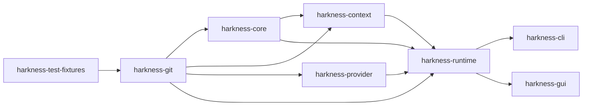

# ADR-0001: v0.4 crate boundaries

- **Status**: Accepted
- **Date**: 2026-08-10
- **Deciders**: Taiye Babatope
- **Implemented by**: [#109](https://github.com/fullstacktaiye/harkness/issues/109), [#110](https://github.com/fullstacktaiye/harkness/issues/110), [#111](https://github.com/fullstacktaiye/harkness/issues/111), [#123](https://github.com/fullstacktaiye/harkness/issues/123), [#126](https://github.com/fullstacktaiye/harkness/issues/126), [#127](https://github.com/fullstacktaiye/harkness/issues/127)
- **Builds on**: [#84](https://github.com/fullstacktaiye/harkness/issues/84) (v0.3 epic), [#85](https://github.com/fullstacktaiye/harkness/issues/85), [#86](https://github.com/fullstacktaiye/harkness/issues/86), [#87](https://github.com/fullstacktaiye/harkness/issues/87), [#88](https://github.com/fullstacktaiye/harkness/issues/88), [#96](https://github.com/fullstacktaiye/harkness/issues/96), [#97](https://github.com/fullstacktaiye/harkness/issues/97), [#142](https://github.com/fullstacktaiye/harkness/issues/142) (v0.4 epic)

## Context

The workspace is five crates whose dependencies flow strictly downward:
`harkness-test-fixtures` (dev-only) and `harkness-git` beneath `harkness-core`
and `harkness-runtime`, with `harkness-cli` and `harkness-gui` on top. Nothing
lower reaches back up, and `harkness-git` is addressed purely by filesystem path
— it has no knowledge of the project catalog, which is what makes the
repository-lock-then-catalog-lock ordering impossible to violate from inside it.

`harkness-runtime` already carries the v0.3 spine that v0.4 builds on: the
domain records and state machines ([#85](https://github.com/fullstacktaiye/harkness/issues/85)),
the migrated SQLite store ([#86](https://github.com/fullstacktaiye/harkness/issues/86)),
the typed tool contract and registry ([#87](https://github.com/fullstacktaiye/harkness/issues/87)),
and the append-only event log with artifact storage
([#88](https://github.com/fullstacktaiye/harkness/issues/88)) — all merged. The
rest of v0.3 (policy [#91](https://github.com/fullstacktaiye/harkness/issues/91),
approvals [#92](https://github.com/fullstacktaiye/harkness/issues/92), the
`Agent` seam [#96](https://github.com/fullstacktaiye/harkness/issues/96), the
coordinator [#97](https://github.com/fullstacktaiye/harkness/issues/97)) is
planned and cited here as planned.

v0.4 adds two subsystems that are large, independently testable, and pull in
dependencies nothing else in the workspace wants: a context engine (file
inventory, chunking, a second SQLite database, `tree-sitter`, in-process
lexical search) and a model-provider layer (an HTTP client, a wire format, a
streaming assembler). Putting either inside `harkness-runtime` would mean every
`cargo test -p harkness-runtime` pays for tree-sitter grammars and TLS, and it
would leave nothing to stop context code from reaching into run persistence or
provider code from reaching into either.

## Decision

Add two crates and fix their dependency directions.

**`crates/harkness-context`** — the context engine. Depends on `harkness-git`
(for `GitService`, `repository_identity`, and `Cancellation`) and
`harkness-core` (for the data-directory layout). It **must not depend on
`harkness-runtime`**. It owns the workspace snapshot, file inventory and
classification, chunking, the disposable index cache, deterministic retrieval,
ranking, and context-pack assembly. It knows nothing about runs, steps, tool
calls, policy, or approvals, and it is usable standalone — a doc-test
constructs an engine against a fixture repository with no runtime, agent, or
model present ([#110](https://github.com/fullstacktaiye/harkness/issues/110)).

**`crates/harkness-provider`** — the model-provider boundary. Depends on
`harkness-git` for exactly one thing, the shared `Cancellation` token, on the
same reasoning that already justifies `harkness-runtime`'s dependency on it: one
cancellation seam across the workspace, not a second token type. It **must not
depend on `harkness-runtime` and must not depend on `harkness-context`**. It
owns the provider-neutral contract, the streaming assembler, the deterministic
scripted provider, provider configuration, and every concrete adapter. Adapter
wire types stay private to their module.

**`harkness-runtime`** depends on both new crates and is the only place they
meet. It gains `tools/context_*.rs` (context exposed to a model as typed tools,
[#123](https://github.com/fullstacktaiye/harkness/issues/123)), `agent/native/`
(the `ModelAgent` implementing the `Agent` trait,
[#126](https://github.com/fullstacktaiye/harkness/issues/126)), `prompt/`
(versioned message construction,
[#127](https://github.com/fullstacktaiye/harkness/issues/127)), and `aiconfig`
(the settings that bind a project to a provider profile and an engine
configuration).

`harkness-cli` and `harkness-gui` reach AI features only through
`harkness-runtime` surfaces. Neither front end takes a direct dependency on
`harkness-context` or `harkness-provider`.

An arrow points from a crate to the crates that may depend on it. There is no
arrow from `runtime` to `context` or `provider`, and none between `context` and
`provider`; those three absences are the decision.

## Consequences

- The forbidden directions are mechanically checkable. `harkness-runtime` must
  not appear in either new crate's `Cargo.toml`, and `harkness-context` must not
  appear in `harkness-provider`'s — an acceptance criterion on
  [#109](https://github.com/fullstacktaiye/harkness/issues/109) and
  [#111](https://github.com/fullstacktaiye/harkness/issues/111) rather than a
  convention.
- Anything the two new crates share with the runtime has to be expressed in
  types they can both see. Context provenance travels into `runtime.db` as a
  frozen wire form ([#109](https://github.com/fullstacktaiye/harkness/issues/109))
  that the runtime persists; the context crate never writes a run record, and
  the runtime never reaches into the index cache.
- A context feature that wants a run identifier does not get one. Correlation
  runs the other way: the runtime holds the `SnapshotId` and attaches it to the
  events and rows it writes.
- Tests get cheaper and more honest. Provider streaming is exercised with no
  network and no repository; retrieval quality is exercised with no model. The
  crate that fails tells you which subsystem broke.
- The runtime's dependency list grows, and `cargo test -p harkness-runtime`
  pays for both new crates' compile time. That is the price of having one place
  where they meet, and it is charged to the crate that does the meeting.
- `harkness-provider` depending on `harkness-git` looks wrong at a glance and
  will keep looking wrong. It is one type, it is already precedent, and the
  alternative — a second cancellation mechanism to translate between — is worse.

## Alternatives considered

**One `harkness-ai` crate holding both subsystems.** Fewer manifests, and the
`ModelAgent` would have both halves in scope. Rejected: the two subsystems share
no types and no dependencies, so the only thing merging them buys is the
opportunity for retrieval code to call a provider directly, which is the
provider lock-in ADR-0002 and ADR-0007 exist to prevent. A boundary that only
holds when everyone remembers it is not a boundary.

**Both subsystems inside `harkness-runtime`.** No new crates, no dependency
questions. Rejected: it makes `tree-sitter`, `rusqlite` (a second time), and an
HTTP client mandatory for anyone building the runtime, and it deletes the
compile-time proof that context code cannot read run persistence. Every
guarantee in ADR-0004 would become a code-review promise.

**`harkness-context` depending on `harkness-runtime` for the tool contract**, so
context tools live beside the engine. Rejected: it inverts the layering — the
runtime is the composition point — and it means the engine cannot be used or
tested without a database. Context tools live in `harkness-runtime/tools/`,
where the registry already is.

**A shared `harkness-cancel` crate** so `harkness-provider` need not depend on
`harkness-git`. Rejected as premature: it moves one `Arc<AtomicBool>` newtype
into a sixth crate to improve the look of a dependency graph, and it breaks the
existing `harkness-runtime` → `harkness-git` precedent for no behavioral gain.
Revisit if a third consumer wants cancellation without Git.
