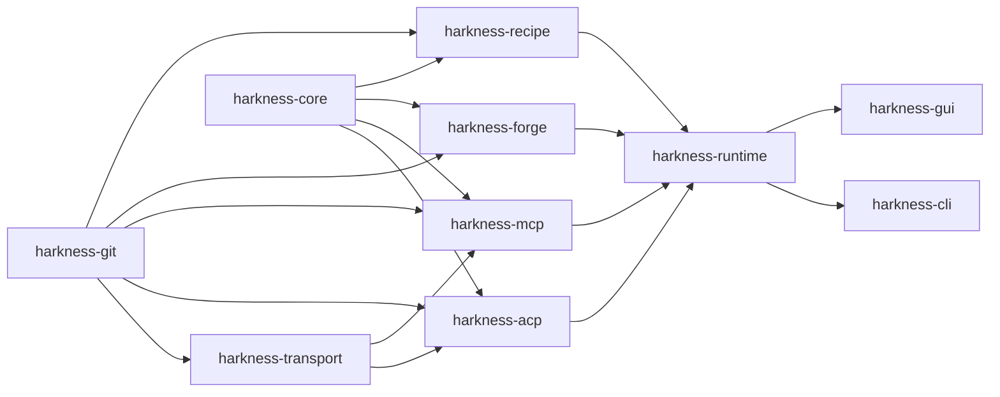

# ADR-0009: v0.5 adapter crate boundaries and wire-type privacy

- **Status**: Accepted
- **Date**: 2026-08-13
- **Deciders**: Taiye Babatope
- **Implemented by**: [#145](https://github.com/fullstacktaiye/harkness/issues/145), [#147](https://github.com/fullstacktaiye/harkness/issues/147), [#149](https://github.com/fullstacktaiye/harkness/issues/149), [#157](https://github.com/fullstacktaiye/harkness/issues/157), [#163](https://github.com/fullstacktaiye/harkness/issues/163), [#164](https://github.com/fullstacktaiye/harkness/issues/164), [#170](https://github.com/fullstacktaiye/harkness/issues/170)
- **Builds on**: [#186](https://github.com/fullstacktaiye/harkness/issues/186) (v0.5 epic), ADR-0001

## Context

The workspace is seven crates whose dependencies flow strictly downward, and
ADR-0001 fixed the pattern that produced them: a subsystem large enough to have
its own dependencies and its own failure modes gets its own crate, and the edge
that would let it reach back up is named and forbidden rather than discouraged.
`harkness-context` may not name `harkness-runtime`; `harkness-provider`
([#111](https://github.com/fullstacktaiye/harkness/issues/111), planned) may name
neither it nor `harkness-context`. Those absences are what make the layering a
property instead of a habit.

v0.5 adds four external contract surfaces at once, and they differ from every
subsystem the workspace has added so far in one way that matters: **Harkness does
not own their types.** The Agent Client Protocol, the Model Context Protocol, and
the GitHub REST API are specified elsewhere, revised on someone else's schedule,
and spoken by peers Harkness did not write. Workflow recipes are Harkness's own
format, but they are authored by users and shipped inside repositories, which
puts their parsed form in the same category of input.

`harkness-runtime` is the crate those surfaces would otherwise land in, and it is
the worst place for them. It holds Harkness's own durable vocabulary:
`RUNTIME_RECORD_SCHEMA_VERSION`, probe-first parsing, `deny_unknown_fields`, and
frozen fixtures under `src/domain/fixtures/` and `src/store/fixtures/` that pin
released on-disk formats. A protocol type sitting beside those records is one
`serde` derive away from being persisted, and the moment it is, an upstream
revision that Harkness does not control becomes a `runtime.db` migration that
Harkness does control and must ship.

The four surfaces also arrive with concretely different dependencies — an ACP
schema crate, a JSON-RPC engine, an HTTP client with TLS, a TOML parser — none of
which anything else in the workspace wants, and each of which would otherwise be
paid for by every `cargo test -p harkness-runtime`.

## Decision

Add four crates and fix their dependency directions.

- **`crates/harkness-acp`** — the ACP client adapter. Wire types, `initialize`,
  version and capability negotiation, session lifecycle, streaming updates.
- **`crates/harkness-mcp`** — the MCP client adapter. Wire types, revision
  selection, tool discovery, tool invocation.
- **`crates/harkness-forge`** — forge-neutral contracts
  ([#163](https://github.com/fullstacktaiye/harkness/issues/163)) and the GitHub
  REST adapter that satisfies them
  ([#164](https://github.com/fullstacktaiye/harkness/issues/164)).
- **`crates/harkness-recipe`** — the recipe source format: schema, parser,
  validation, and the compiler that produces an execution plan.

**Each is strictly below `harkness-runtime`.** The runtime depends on them; none
of them may name `harkness-runtime`, `harkness-cli`, or `harkness-gui`. They may
depend on `harkness-git` (for `Cancellation`, on the precedent ADR-0001 already
accepted) and on `harkness-core` (for the data-directory layout).

**No adapter depends on another adapter.** Shared machinery goes *below* all four
rather than sideways between two of them: the JSON-RPC subprocess engine both
protocol adapters need is a separate crate beneath them, decided in ADR-0012 and
built by [#147](https://github.com/fullstacktaiye/harkness/issues/147). The
worked example is MCP-over-ACP: an ACP `session/new` carries MCP server
configuration, and that configuration is ACP wire data described by ACP types
passing through `harkness-acp`. It does not make `harkness-acp` an MCP client, and
it must not become an edge to `harkness-mcp`. Where the two protocols genuinely
have to be composed, `harkness-runtime` is where they meet.

**Protocol wire types are private to their adapter.** Precisely: no type defined
by ACP, MCP, or the GitHub REST API — and no type generated from their schemas —
may appear in an adapter crate's public API, in a `harkness-runtime` domain
record, or in anything Harkness persists: `runtime.db` columns, event payloads,
artifact metadata, `projects.json`, or CLI JSON output. Conversion into
Harkness-owned domain types happens at the adapter's public surface, and that
conversion is the only thing an upstream revision can break.

The rule is about *typed dependence*, not about bytes. A raw protocol transcript
captured for diagnosis is stored as an artifact
([#88](https://github.com/fullstacktaiye/harkness/issues/88)) as opaque content;
no schema anywhere claims to know its shape, so no upstream revision invalidates
a stored one.

**Integration glue lives in `harkness-runtime`, not in the adapters.** External
identity and the unified trust records
([#146](https://github.com/fullstacktaiye/harkness/issues/146), ADR-0016) are
runtime types, because trust has to compose with workspace trust
([#90](https://github.com/fullstacktaiye/harkness/issues/90)) and the policy
evaluator ([#91](https://github.com/fullstacktaiye/harkness/issues/91)), which
adapters cannot see. An adapter reports what it observed — a path, a hash, a
version, a schema fingerprint — as plain data, and the runtime builds the
identity record from it.

An arrow points from a crate to the crates that may depend on it. There is no
arrow from `runtime` to any of the four adapters, and there are no arrows
*between* the four adapters. Those two absences are the decision: the runtime
may name an adapter, an adapter may never name the runtime, and no adapter may
name another.

## Consequences

- The rule is mechanically checked rather than reviewed. Each adapter crate
  carries a test that reads its own `Cargo.toml` and fails if it names the
  runtime or a front end, and all four crates are in the CI per-crate matrix
  from the commit that creates them. A skeleton crate with one test is a crate
  whose only current responsibility is the thing it could get wrong.
- Every adapter needs a conversion layer, and conversion layers are tedious. An
  MCP tool descriptor becomes a Harkness tool descriptor by hand, field by
  field, and the compiler will not write that for anyone. The payment is
  ongoing; what it buys is that an upstream field rename is a compile error in
  one file rather than a migration.
- An adapter cannot correlate its own work to a run, because it cannot name a
  `RunId`. Correlation flows downward: the runtime holds the identifiers and
  attaches them to the events and rows it writes, exactly as ADR-0001 already
  arranged for context provenance.
- The workspace goes from seven crates to eleven, and to twelve when
  [#147](https://github.com/fullstacktaiye/harkness/issues/147) adds the shared
  transport. Four of those are currently empty, which looks like ceremony and
  is: the boundary is being paid for before it is used, because it is much
  cheaper to draw now than to extract later.
- `harkness-runtime`'s dependency list and compile time grow again, on top of
  what ADR-0001 already charged it. That crate is the composition point, and the
  cost of composition is charged to the composer.
- Nothing in v0.5 can hand a front end an ACP or MCP type, so the GUI models
  ([#176](https://github.com/fullstacktaiye/harkness/issues/176),
  [#177](https://github.com/fullstacktaiye/harkness/issues/177)) and the CLI JSON
  projection ([#180](https://github.com/fullstacktaiye/harkness/issues/180)) are
  written against Harkness vocabulary from the first line. This is the intended
  outcome and it will occasionally feel like an extra hop for a field that
  already exists upstream in exactly the right shape.

## Alternatives considered

**Modules inside `harkness-runtime`** — `runtime/src/acp/`, `runtime/src/mcp/`,
and so on. No new manifests, and the integration glue would sit next to the
adapters that feed it. Rejected: it puts protocol wire types in the same crate as
the frozen, versioned records they must never become, and it makes every guard
against that a review-time promise. It also makes `cargo test -p
harkness-runtime` pay for an HTTP stack, a TOML parser, and a JSON-RPC engine to
run a state-machine unit test.

**One combined `harkness-integrations` crate** holding all four surfaces. One
manifest, one place to look. Rejected: it forces every consumer of *any*
integration to compile *all* of them — a CLI that only lists GitHub issues would
build the ACP schema crate — and it removes the compile-time proof that the ACP
adapter cannot call the MCP adapter directly. Four unrelated protocols in one
crate share nothing but the fact that they are external.

**Adapters allowed to depend on each other, so the JSON-RPC engine can live in
`harkness-acp` and be reused by `harkness-mcp`.** One fewer crate, and the engine
would have a real consumer from day one. Rejected: it makes the MCP adapter's
build depend on the ACP schema crate for no reason, and it establishes exactly
the sideways edge that later makes "MCP over ACP" look like a dependency instead
of a composition. Shared machinery belongs below both, not inside one of them.

**Wire types public, with a documented rule that the runtime must not persist
them.** Cheaper: no conversion layer, and diagnostics get the full upstream type
for free. Rejected: the rule would hold until the first time someone needed one
extra field in a run record at 5pm. The conversion layer is not overhead, it is
the enforcement.

**Defer the crates until the code that fills them exists**, creating each one
with its first feature. Rejected on evidence from the milestone shape: six issues
([#146](https://github.com/fullstacktaiye/harkness/issues/146),
[#147](https://github.com/fullstacktaiye/harkness/issues/147),
[#149](https://github.com/fullstacktaiye/harkness/issues/149),
[#157](https://github.com/fullstacktaiye/harkness/issues/157),
[#163](https://github.com/fullstacktaiye/harkness/issues/163),
[#170](https://github.com/fullstacktaiye/harkness/issues/170)) begin in parallel
against these boundaries, and the first one to land would otherwise decide the
layering for the other five by accident.
