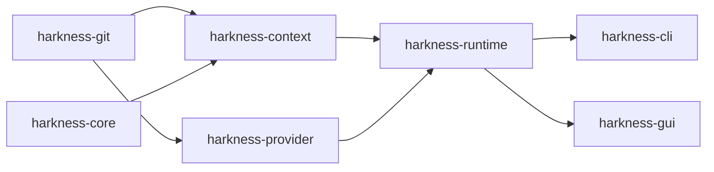
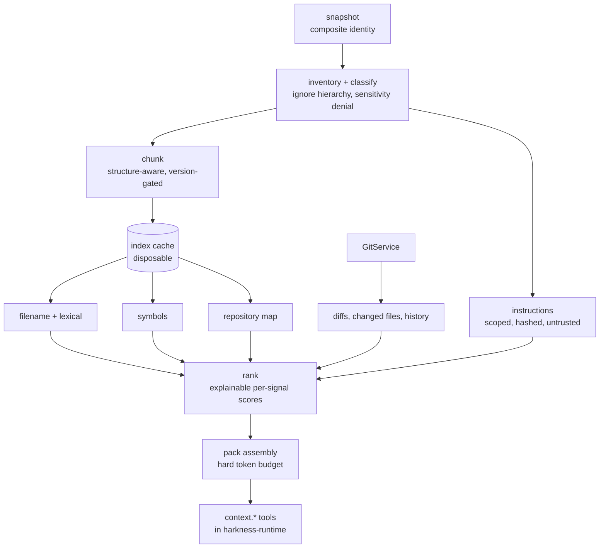
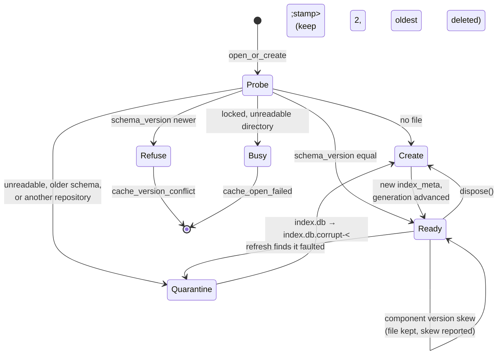

# Context engine and native AI workflow

This document is the one-page map of v0.4: how repository content becomes
bounded, evidence-backed context; where the model-provider boundary sits; and
how the native agent loop occupies the seam the v0.3 runtime already provides.
It describes the architecture, not the implementation — the decisions behind it
live in [`docs/adr/`](adr/README.md), and each section names the ADR that binds
it.

The runtime spine this builds on — the crate map, the Task → Run → Step → Tool
call hierarchy, both state machines, and the threading model — is documented in
`docs/architecture-runtime.md` ([#105](https://github.com/fullstacktaiye/harkness/issues/105));
this document extends it rather than restating it. Where a v0.3 contract is
named here, that document is the authority on it.

## Position in the workspace

Two new crates join the existing five. Neither depends on `harkness-runtime`;
the runtime depends on both and is the only place they meet (ADR-0001).



- **`harkness-context`** — snapshot identity, file inventory, chunking, the
  disposable index cache, deterministic retrieval, ranking, and pack assembly.
  Usable standalone: it needs no runtime, no database of runs, and no model.
- **`harkness-provider`** — the provider-neutral model contract, the streaming
  assembler, the deterministic scripted provider, and every concrete adapter.
  Adapter wire types never leave their module.
- **`harkness-runtime`** — gains context tools, the native agent, prompt
  construction, and AI configuration. Front ends reach AI features only here.

## Snapshot identity

`WorkspaceSnapshot` is the type every later stage is relative to. Its shape is
worth stating precisely, because two things that look like one are deliberately
separate:

- **`SnapshotId`** names a *capture*. It is a random v4 UUID minted each time the
  workspace is read, and it is what provenance records and what events correlate
  by, so a run inspected later can be traced to the exact read it was built from.
- **`SnapshotDigest`** names a *workspace*. It is the composite digest over the
  ten identity components, and it is what a staleness check compares. Capturing
  one unchanged workspace twice yields two ids and one digest.

Capture reads Git for *what* changed and a `WorkspaceProbe` for *what those paths
now contain*. The split is what keeps the identity model testable without a
filesystem and leaves eligibility — ignore rules, size limits, classification —
to the inventory stage without the digest definition moving. `FilesystemProbe` is
the default: it hashes regular files in 64 KiB blocks, hashes a symlink's target
*path* rather than following it, refuses to open anything else, resolves every
path through a check that it stays inside the worktree, and expands an untracked
directory Git reported as one entry.

Two rules in that expansion carry more weight than they look like they do. A
failure *inside* a tree is recorded per sub-path rather than collapsing the tree:
one sentinel for a whole subtree would freeze its digest, and a frozen digest
means every later edit beneath it verifies as `Fresh`. And a probe caching
anything about the workspace invalidates it in `begin_read`, because a probe is
naturally held for a worktree while a snapshot describes a moment — a cached Git
index served to a later verification answers from the past.

The two operations differ in what they owe the caller, which is why they fail
differently. `capture` must not hand back a half-built identity, so cancellation
is an error. `verify` always owes a verdict, so a repository that vanished, a
missing root, an unreadable status, or a cancelled check all return
`Unverifiable` with a reason — never a soft `Fresh`. A `Stale` verdict names each
diverged path and which component it belongs to, which is what lets a refused
mutation say *why*.

Capture is tolerant of a workspace that moves underneath it. A file that changes
mid-hash contributes the bytes that were read; a file that cannot be read
contributes a sentinel and a diagnostic rather than failing the capture. A
snapshot is an honest record of what was read, and verification is what turns
that honesty into safety before a write.

Snapshots hold hashes and paths, never file contents, so they are safe to persist
and to display. The only absolute path is the worktree root.

## The context pipeline

Retrieval is deterministic-first: structure, lexical search, symbols, Git state,
and instructions are the required foundation, and semantic embeddings are an
optional strategy behind an interface that nothing depends on for correctness
(ADR-0005).



Each stage in one line:

- **Snapshot** — captures workspace identity as a composite digest over
  repository identity, worktree root, `HEAD`, branch, index, tracked-dirty,
  untracked, instruction-set, config generation, and index generation. `HEAD`
  alone is never identity (ADR-0008).
- **Inventory and classify** — walks the ignore hierarchy and classifies each
  eligible file. Sensitive paths are denied **at the walk**, so they never enter
  the index and cannot be retrieved by any later stage.
- **Chunk** — structure-aware boundaries with anchors that stay stable when
  unrelated regions of a file change, so a small edit does not invalidate a
  file's whole chunk set.
- **Index cache** — one SQLite database per repository at
  `<data_dir>/context/<repository-key>/index.db`, keyed by the same v5 UUID as
  the repository lock. Disposable by design (ADR-0004).
- **Retrieval sources** — filename and lexical search over the index, symbol
  lookup, the repository map, Git-derived context through the existing
  `GitService`, and discovered instruction files.
- **Rank** — deterministic scoring with a serializable explanation per signal.
  Exact matches, run-changed files, import adjacency, and test↔source pairing
  promote; generated, vendored, and near-duplicate content demotes.
- **Pack** — a hard budget ledger over system text, objective, history, tool
  definitions, tool results, map, retrieved code, reserved output, and safety
  margin. Overflow drops the lowest-ranked items with a *typed exclusion
  reason*, then truncates on a UTF-8 boundary and records that it did. A pack
  never knowingly exceeds its budget, and estimated counts are marked estimated.
- **Context tools** — the model reaches all of this only through typed tools in
  `harkness-runtime`, so every context request is schema-validated, policy-
  evaluated, approval-gated where required, and persisted like any other call.

Every item that comes out carries provenance: source, path, byte range, symbol,
content hash, snapshot id, selection reason, rank explanation, truncation, and
sensitivity. That record is what the pack inspector renders and what makes a
past run auditable.

## Two stores

| | `runtime.db` + `artifacts/` | `<data_dir>/context/.../index.db` |
| --- | --- | --- |
| Holds | runs, steps, tool calls, events, approvals, snapshots, packs, provenance, turns, provider requests | file inventory, chunks, symbols, search structures, cached scores |
| Character | evidence | derivation |
| Versioning | numbered migrations, never edited once released | `index_meta`: `schema_version`, `parser_version`, `chunking_version`, `ranking_version`, plus `index_generation` |
| On corruption | refuse and report | quarantine, recreate, bump generation |
| Cost of deleting it | run history and audit trail | warm-up time, nothing else |

Deleting `<data_dir>/context/` is always safe (ADR-0004). The engine's
index-writer lock is leaf-level: it is never held while acquiring the repository
lock or the catalog lock, so the existing repository-then-catalog ordering is
untouched.

### Cache lifecycle

Opening a cache reads it before it writes to it. That order is the whole of the
refusal guarantee: a cache written by a newer build is left byte-identical
rather than downgraded, because nothing has touched it by the time the decision
is made.



Three distinctions in that diagram carry weight:

- **`Refuse` and `Quarantine` are opposite answers to a version mismatch.** A
  *newer* `schema_version` means a sibling process understands the file and this
  build does not, so it is left alone; an *older* one means nothing does, and the
  cache is disposable, so it is replaced. There is no downgrade path.
- **`Busy` is not `Quarantine`.** Contention, a permission bit, and a read-only
  directory say nothing about what the file holds. Treating a locked cache as a
  corrupt one would let one front end destroy the other's index by being slow.
- **A component version never moves the file.** Parser, chunking and ranking
  versions describe what produced the rows rather than where they sit, so a
  mismatch keeps the cache, keeps the *stored* version, and reports the skew —
  overwriting it would erase what incremental reconciliation needs to know.

The engine survives all of it. A cache that cannot be prepared does not fail
`ContextEngine::open`: the failure is remembered, `index_status` reports it, and
the Git-backed half — workspace identity above all — keeps answering. Losing
retrieval is a degradation; losing the ability to say which workspace a run read
would stop the run.

It is not remembered *forever*, either. The commonest way to reach `Busy` is
another front end holding the cache for a few seconds at exactly the wrong
moment, so `refresh_index` and `dispose_index` retry the open before doing
anything else — an engine that answered "no index" for its whole life because of
five seconds at startup would make the failure far more expensive than its
cause.

## The provider boundary

Three distinct contracts, and no type unifies them (ADR-0002):

- A **model provider** accepts messages and tool definitions and streams text
  and tool-call *requests*. It has no filesystem, Git, process, or credential
  access.
- The **native agent** — Harkness — owns planning, context, prompts, tool
  execution, policy, approvals, verification, persistence, retry, and
  cancellation.
- An **external coding agent** owns its own loop. Hosting one is deferred to a
  later milestone; v0.4 names the seam and ships none.

Transport is blocking HTTP with SSE parsed on the calling worker thread, with
cancellation through the workspace's existing `Cancellation` token polled at the
20 ms cadence. **No async runtime enters the workspace in v0.4** (ADR-0003). The
one production adapter speaks the OpenAI-compatible chat-completions format,
which covers Ollama, llama.cpp server, vLLM, LM Studio, and hosted compatible
endpoints, and needs no credential against a local endpoint; CI runs against a
deterministic scripted provider and an in-process loopback fixture, with
real-endpoint smoke tests opt-in and `#[ignore]`d (ADR-0007).

## The native loop

The loop adds no run states. `ModelAgent` implements the existing `Agent` trait
and is driven by the unchanged `RunCoordinator`; turn phases are rows and
events, not a second state machine beside `RunState`.

```
RunCoordinator
  └── ModelAgent  (implements Agent)
        ├── build context ──► ContextEngine ──► context.* tool calls
        ├── render prompt  ──► versioned, role-separated, budget-aware
        ├── stream turn    ──► ModelProvider  (blocking, cancellable)
        └── request tools  ──► coordinator ──► registry → policy → approval → execute → persist
```

The model requests; the runtime decides. Every tool call the model asks for
passes through schema validation, policy evaluation, approval where required,
and persistence — the same path the mock agent's calls take. The loop is bounded
on every axis (turns, tool calls, identical calls, wall clock, output bytes,
provider retries, context rebuilds, verification attempts) and every stop
carries a typed, persisted reason. Mutating calls never auto-retry, and a
duplicate call replays its recorded result rather than executing twice.

Repository content — including instruction files, tool output, and anything the
model streams back — is untrusted data throughout: always delimited as such in
prompts, never placed in a system role, able to tighten policy and exclusions
but never to widen them, and never a source of capability (ADR-0006).

## Extension seams

The design leaves these seams open and implements **none** of them in v0.4.
Each is named so a future milestone extends the architecture rather than
renegotiating it.

- **MCP (Model Context Protocol)** — external tool servers. They register into
  the existing tool registry with normalized schemas, namespaced identifiers,
  and classified risk, so they inherit policy, approvals, and persistence
  unchanged. Post-v0.4: [#157](https://github.com/fullstacktaiye/harkness/issues/157)–[#162](https://github.com/fullstacktaiye/harkness/issues/162).
- **ACP (Agent Client Protocol)** — hosting external coding agents such as
  Gemini CLI. They sit *beside* the native agent under the coordinator, and
  their permission requests map into Harkness policy and durable approval rather
  than running alongside it. This is the milestone ADR-0002's deferral points
  at: [#149](https://github.com/fullstacktaiye/harkness/issues/149)–[#156](https://github.com/fullstacktaiye/harkness/issues/156).
- **Plugin adapters** — third-party tools, providers, or retrieval strategies
  loaded outside the workspace build. The seams already exist as traits
  (`Tool`, `ModelProvider`, the retrieval-strategy interface); what is missing
  is identity, versioning, trust, and a loading mechanism, all deliberately out
  of scope.
- **Remote executors** — running tools somewhere other than this machine.
  `ExecutionContext` is the boundary that would carry it; nothing in the tool
  contract assumes local execution except the path-containment rules, which
  would need a remote analogue.
- **Multi-agent orchestration** — more than one agent on one objective, or
  agents that spawn agents. The run model already nests (task → run → step), and
  the coordinator is the place it would live. v0.4 ships one agent per run,
  deliberately.

Two further seams are named in the v0.4 epic and equally out of scope:
**semantic retrieval** (a strategy behind the existing interface, with its own
ADR when it arrives — ADR-0005) and **summarization-based context compression**
(v0.4 bounds context by truncation and typed exclusion only).

## Where to read next

- [`docs/adr/README.md`](adr/README.md) — the eight v0.4 decisions, with the
  reasoning and the alternatives that lost.
- `docs/architecture-runtime.md` — the v0.3 runtime spine this builds on
  ([#105](https://github.com/fullstacktaiye/harkness/issues/105)).
- `AGENTS.md` — the normative invariants a contributor can violate silently.
- Crate-level `//!` documentation in `harkness-context` and `harkness-provider`
  — the contracts themselves, once they land.
