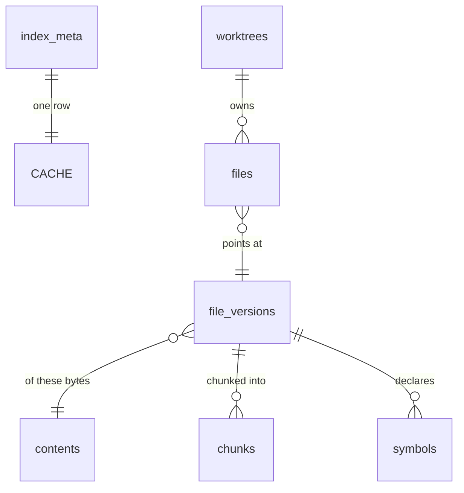
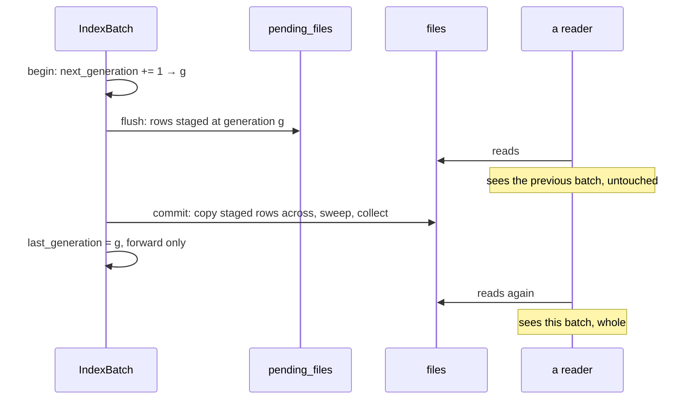

# The context index

The context index is one SQLite database per repository at
`<data_dir>/context/<repository-key>/index.db`, holding everything Harkness has
derived from that repository's content: which files exist, what class each one
is, which bytes each version holds, where its chunks begin and end, and which
symbols were extracted from it.

**It is a cache.** Deleting `<data_dir>/context/` at any moment costs warm-up
time and loses no run history, provenance, approval, or artifact — that is
ADR-0004's split, and it is the property every design decision below is
downstream of. "Reclaim disk" and "fix a weird index" are one command.

`harkness-context`'s `index` module is the implementation and its `//!`
documentation is the contract; `AGENTS.md`'s "Context Engine & Index Cache
Invariants" is the normative list of what may not change. This document is the
reference: what the cache holds, how a write becomes visible, what a version
bump takes away, and what happens when it runs out of room.

## What it holds

Six tables, and exactly one of them is per-worktree.

| Table | Keyed by | Holds |
| --- | --- | --- |
| `index_meta` | the constant `1` | schema and component versions, the generation, the repository identity, when it was created and last opened |
| `worktrees` | worktree key | one checkout's root, its visible generation, and its generation allocator |
| `files` | `(worktree_id, path)` | **the only per-worktree rows**: size, modification time, class, symlink and boundary flags, the classification version, and the batch that confirmed it |
| `pending_files` | `(worktree_id, generation, path)` | the same rows, staged by a batch in flight, before anything can see them |
| `contents` | content SHA-256 | the size of one distinct blob of bytes |
| `file_versions` | file-version id | one path's bytes: language, whether the text was transcoded, whether the chunk set stops short of the whole file, and the chunking and parser versions its derived rows were produced under |
| `chunks` | `(file_version_id, chunk_id)` | anchor, ordinal, byte range, line hints, chunk digest, associated symbol |
| `symbols` | `(file_version_id, symbol_id)` | name, qualified path, kind, byte range |

The full DDL is `crates/harkness-context/src/index/schema.rs`, frozen as
`crates/harkness-context/src/index/fixtures/schema-v2.sql`. A test compares the
live layout against that fixture, so a column added without a version bump fails
a test rather than leaving already-written caches addressed by a build that
expects different columns.

### Why `file_versions` sits between contents and chunks

The obvious schema hangs chunks off `contents`, keyed by the content digest
alone. That is wrong, and the reason is worth stating because it is not obvious
until `docs/context-identity.md` is read beside it: **which chunker runs is
chosen from the file's class and path**, so the same bytes at `notes.md` and at
`notes.rs` chunk differently — and a `ChunkId` absorbs the path deliberately, so
that two files sharing content keep separate chunk identities.

Chunking is therefore a function of `(path, bytes)`, which is exactly what a
`FileVersionId` names. `contents` still deduplicates the bytes; `file_versions`
deduplicates the *derivation*; and the sharing the repository-keyed cache exists
to buy still happens where it matters, because two worktrees of one repository
see the same paths.

What a `file_versions` row does **not** hold is which chunker ran: that is a
pure function of the class and path the row already carries, and a derivable
column is one that can disagree with what it was derived from. `truncated` is
the opposite case and is stored, because a file whose chunk set hit its per-file
budget is only partly indexed and nothing short of re-chunking it could tell —
the difference between "there is no match here" and "there is no match in the
part that was indexed".

### The keying invariant

`files` is the only table a worktree owns. Every read takes a `WorktreeKey` and
joins through that worktree's `files` rows, and there is no public query that
reaches the content tables directly. That is [#115]'s isolation contract
expressed as an API shape rather than as query discipline: the only way to write
a query that leaks one checkout's rows into another's answer is to add a method
that does not take the key.

A worktree key is the v5 UUID of the **canonical worktree root**, not of a
project id. A project id names a catalog entry and two entries can name one
checkout; keying by project would build two copies of one tree's file rows and
let each sweep the other's away.

## How a write becomes visible

Nothing a batch writes is visible until it commits, and then all of it is.

**A batch never writes `files`.** That is the part it is easiest to get wrong,
and the failure is quiet: tagging the live row with an uncommitted generation
makes the committed record invisible for the length of the batch, and an
abandoned batch then strands it where the next `begin` deletes it — a file that
still exists, gone from the index. Staging keeps the two rows apart, so a batch
in flight is unobservable rather than merely filtered out.

Three further consequences, each of which is the point rather than a side effect:

- **A killed process leaves nothing partial.** The watermark never moved, so no
  query returns the rows, and the next batch for that worktree deletes them. The
  work is redone, never resumed.
- **A cold build does not hold the write lock.** Rows are flushed during the
  batch, in their own transactions, so a reader interleaved with a hundred
  thousand files still answers — from the previous generation — instead of
  queueing behind it.
- **A generation is allocated once, and the watermark only moves forward.** Two
  front ends indexing one repository both stage, side by side, keyed apart by
  generation; the first to commit wins and the second is refused with
  `index_batch_superseded`. Letting the loser through would drag the watermark
  back below the winner's generation and hide every row it published — a commit
  that reported success while making the index smaller. The refusal is also what
  makes cleanup decidable: a batch below the watermark can no longer publish, so
  its staged rows are provably dead and the next commit collects them.

### Full and targeted

| Scope | Presents | Unconfirmed rows | Content collection |
| --- | --- | --- | --- |
| `Full` | every path of the worktree | swept | every unreferenced row |
| `Targeted` | only the paths it names | left alone | only the versions it displaced |

The distinction is not a performance switch. A full batch that swept nothing
would leave deleted files in the index forever; a targeted batch that swept
would delete the whole repository because one file changed.

`ContextEngine::reindex` picks the scope from the walk rather than from the
caller: **a truncated inventory commits as targeted.** An inventory stopped by
its file or time budget did not see the whole worktree, and a full batch would
have the index delete rows for files that exist.

## Versions and invalidation

Five versions live in `index_meta`, and they fail in two different ways.

`schema_version` describes the cache's own layout. It is the only one a mismatch
cannot be reconciled from:

- **newer than this build** — refused with `cache_version_conflict` and left
  byte-identical. A sibling process understands the file and this one does not.
- **older than this build** — quarantined and recreated. Nothing understands it,
  and the cache is disposable, so there is no downgrade path and none may be
  added.

The four component versions describe what *produced* the rows rather than where
they sit. A mismatch keeps the file, keeps the stored version, and reports the
skew through `index_status`. `IndexCache::refresh` is the only thing that acts
on one, and it moves the stored version in the same transaction as the rows it
drops:

| Skew | What is deleted | Why |
| --- | --- | --- |
| `chunking_version` | `chunks`, and `file_versions.chunking_version` is nulled | a chunk's identity was derived under boundary rules this build does not use, so the row names something nothing can re-derive |
| `parser_version` | `symbols`, and `file_versions.parser_version` is nulled | the same, for symbol identity |
| `ranking_version` | the tables registered as ranking-owned — none yet | a score is meaningful only under the formula that produced it |
| `classify_version` | **nothing** | a `files` row is a true record that a path existed at a size; only its class is suspect, and the row's own `classify_version` is what says so |

`files` survives every component bump. Re-walking a whole repository because a
chunk-boundary rule moved would make every retrieval improvement a cold rebuild,
which is exactly what versioning the components apart is for.

The ownership list is data — `IndexComponent::owned_tables` and
`CORE_TABLES` — and a test holds the schema to it: a table with no owner would
survive the upgrade that invalidated it, and one with two owners would be
emptied by a skew that has nothing to do with it.

## The generation, and the two things called one

Two counters, deliberately unrelated:

- **`index_meta.index_generation`** is a *token* naming this build of the cache.
  It is a component of the workspace snapshot digest (ADR-0008), so a snapshot
  taken against a rebuilt index must never compare equal to one taken against
  the index that produced it. A plain counter cannot promise that, because the
  counter lives in the file being deleted — so it is seeded from the wall clock
  in microseconds with `previous + 1` as a floor.
- **`worktrees.last_generation`** is a *batch* counter, monotonic within one
  cache, and it decides only visibility. It never leaves the cache.

## Corruption, contention, and budgets

**A busy cache is not a corrupt cache.** Contention answers `index_busy` — its
own discriminant, because a caller met by it degrades to reading the workspace
live and retries, while a permission bit or an exhausted descriptor table will
still be there next time. Only a statement about the file's *contents* may
quarantine one; reading a locked file as corruption would let one front end
destroy the other's index simply by being slow.

A corrupt cache is renamed to `index.db.corrupt-<stamp>` (at most two kept,
oldest deleted first), recreated empty, and the generation bumped. The
write-ahead log and shared-memory sidecars go with it rather than being left for
a replacement to recover as its own.

Two budgets, failing in opposite directions:

| Bound | Value | On breach |
| --- | --- | --- |
| `MAX_INDEX_DB_BYTES` | 512 MiB per repository | the batch is refused whole with `index_budget_exhausted`; the previous generation stays usable |
| `MAX_TOTAL_CONTEXT_BYTES` | 4 GiB across `<data_dir>/context/` | least-recently-opened repository caches are removed **entirely**, oldest first, until the subtree fits |

Nothing partial is ever deleted and nothing is ever silently truncated. A cache
that quietly stopped storing rows would answer "no match" for content it never
held, which a caller cannot tell from a repository that does not contain it; a
half-emptied index is a lying index, whereas a missing one is an honest cold
start.

Eviction never deletes a cache a process still holds. Every open `IndexCache`
holds a *shared* advisory lock on `<cache-root>/index.lock` for its whole life
and the sweep takes the *exclusive* one, so liveness is the kernel's answer
rather than a claim in a file — released however the holder ends, `SIGKILL`
included. Recency comes from `index_meta.last_opened_at`, stamped after a build
decides it may adopt the cache, because `atime` is unusable: `relatime` is the
Linux default and `noatime` never updates it at all.

## Security and privacy

The index stores paths, digests, ranges and names, and **no file content**. A
leaked `index.db` exposes structure, never source text; retrieval re-reads the
working tree when it needs bytes.

A denied path — anything the inventory's built-in denial layer excluded — never
reaches the index at all. The walk counts it and records no name
(`docs/context-inventory.md`), so there is nothing here to retrieve, and that is
the whole reason denial happens at the walk rather than at retrieval.

`index_meta.repository_identity` stops a cache being adopted for a repository it
was not built for: a file recording a different identity is quarantined rather
than read, however it came to be at that path.

## What proves this

| Claim | Package | Test |
| --- | --- | --- |
| The layout matches its frozen snapshot | `harkness-context` | `index::schema::tests::the_layout_matches_the_frozen_snapshot` |
| Every table is owned by exactly one component, or by none deliberately | `harkness-context` | `index::schema::tests::every_table_is_owned_once` |
| Rows are invisible until the batch commits | `harkness-context` | `index::store_tests::rows_are_invisible_until_the_batch_commits` |
| A killed process leaves the previous generation answering | `harkness-context` | `index::store_tests::a_process_killed_mid_batch_leaves_the_previous_generation_answering` |
| A generation is allocated once and never reissued | `harkness-context` | `index::store_tests::a_generation_is_allocated_once_and_never_reissued` |
| A single-file update touches only the file it names | `harkness-context` | `index::store_tests::a_targeted_batch_touches_only_the_file_it_names` |
| Two worktrees share content and never see each other's files | `harkness-context` | `index::store_tests::two_worktrees_share_content_and_never_see_each_others_files` |
| A chunking bump empties only the chunks | `harkness-context` | `index::store_tests::a_chunking_bump_empties_only_the_chunks` |
| A parser bump empties only the symbols | `harkness-context` | `index::store_tests::a_parser_bump_empties_only_the_symbols` |
| A classification bump keeps every row and marks them | `harkness-context` | `index::store_tests::a_classify_bump_keeps_every_row_and_marks_them` |
| A schema bump rebuilds rather than invalidating | `harkness-context` | `index::store_tests::a_schema_bump_rebuilds_rather_than_invalidating` |
| A batch past the per-repository cap is refused whole | `harkness-context` | `index::store_tests::a_batch_past_the_per_repository_cap_is_refused_and_the_cache_still_serves` |
| Contention is `index_busy` and never a quarantine | `harkness-context` | `index::store_tests::a_batch_that_cannot_take_the_write_lock_reports_the_cache_busy` |
| A contended cache costs the index and not the workspace | `harkness-context` | `engine::tests::a_contended_cache_costs_the_index_and_not_the_workspace` |
| Eviction removes whole caches, least recently opened first | `harkness-context` | `index::store_tests::eviction_removes_whole_caches_least_recently_opened_first` |
| Eviction skips a cache that is still open | `harkness-context` | `index::store_tests::eviction_skips_a_cache_that_is_still_open` |
| A cold build is readable back through the public API | `harkness-context` | `the_index_is_built_and_read_back_from_outside_the_crate` |
| A full walk sweeps what the worktree no longer has | `harkness-context` | `engine::tests::a_second_reindex_sweeps_what_the_worktree_no_longer_has` |
| A truncated walk never sweeps | `harkness-context` | `engine::tests::a_truncated_walk_commits_as_targeted_and_a_complete_one_as_full` |
| A batch that re-records a path never hides the committed row | `harkness-context` | `index::store_tests::a_batch_that_re_records_a_path_never_hides_the_committed_row` |
| A batch that lost a race is refused, not allowed to move the watermark back | `harkness-context` | `index::store_tests::a_batch_that_lost_the_race_is_refused_rather_than_moving_the_watermark_back` |
| Symbols may be recorded before the file version they belong to | `harkness-context` | `index::store_tests::symbols_recorded_before_their_file_version_are_carried_to_it` |
| A file that became unreadable keeps the derivation it had | `harkness-context` | `index::store_tests::a_file_that_became_unreadable_keeps_the_derivation_it_had` |
| A read that reached its bound says there is more | `harkness-context` | `index::store_tests::a_read_that_reached_its_bound_says_there_is_more` |
| Deleting `context/` loses no run evidence | `harkness-runtime` | `context::tests::deleting_the_whole_context_directory_loses_no_run_evidence` |
| A batch becomes a timeline entry naming what it wrote | `harkness-runtime` | `context::tests::an_index_batch_becomes_a_timeline_entry_naming_what_it_wrote` |

## Where to read next

- [`docs/adr/0004-evidence-versus-index-cache.md`](adr/0004-evidence-versus-index-cache.md)
  — why there are two stores and what deleting one may cost.
- [`docs/context-identity.md`](context-identity.md) — chunk identity, anchors,
  and the `CHUNKING_VERSION` bump procedure.
- [`docs/context-inventory.md`](context-inventory.md) — the walk that decides
  what reaches the index at all.
- [`docs/architecture-context.md`](architecture-context.md) — the pipeline this
  sits in the middle of.

[#115]: https://github.com/fullstacktaiye/harkness/issues/115
