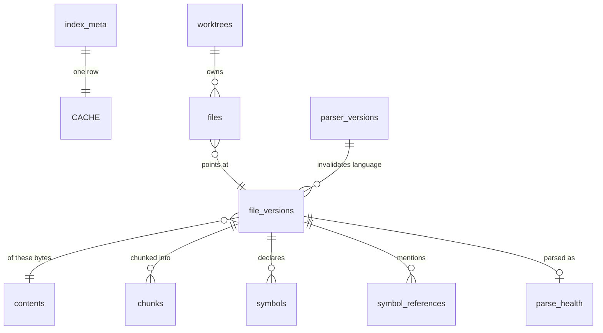
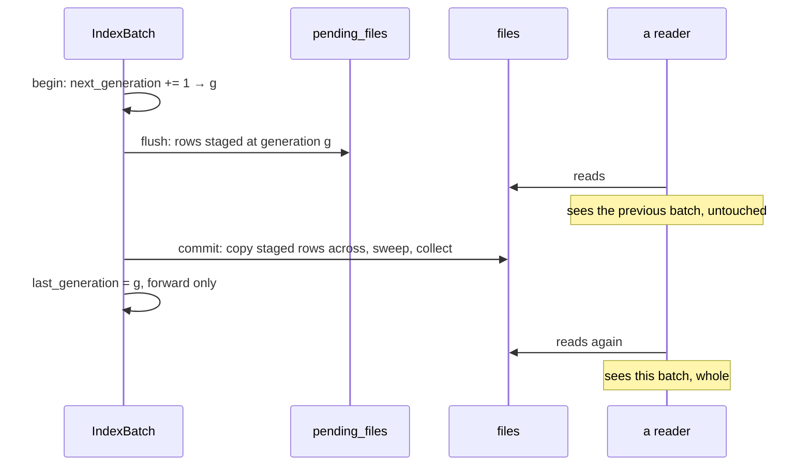

# The context index

The context index is one SQLite database per repository at
`<data_dir>/context/<repository-key>/index.db`, holding everything Harkness has
derived from that repository's content: which files exist, what class each one
is, which bytes each version holds, where its chunks begin and end, and which
symbols were extracted from it.

**It is a cache.** Deleting `<data_dir>/context/` at any moment costs warm-up
time and loses no run history, provenance, approval, or artifact — that is
ADR-0004's split, and it is the property every design decision below is
downstream of. "Reclaim disk" and "fix a weird index" are one command.

`harkness-context`'s `index` module is the implementation and its `//!`
documentation is the contract; `AGENTS.md`'s "Context Engine & Index Cache
Invariants" is the normative list of what may not change. This document is the
reference: what the cache holds, how a write becomes visible, what a version
bump takes away, and what happens when it runs out of room.

## What it holds

Eleven tables. `files` is the only visible per-worktree content table;
`pending_files` is its invisible per-worktree staging area.



| Table | Keyed by | Holds |
| --- | --- | --- |
| `index_meta` | the constant `1` | schema and component versions, the generation, the repository identity, when it was created and last opened |
| `worktrees` | worktree key | one checkout's root, its visible generation, its generation allocator, and the committed base a whole-worktree pass last verified it against |
| `files` | `(worktree_id, path)` | **the only per-worktree rows**: size, modification time, class, symlink and boundary flags, the classification version, and the batch that confirmed it |
| `pending_files` | `(worktree_id, generation, path)` | the same rows, staged by a batch in flight, before anything can see them |
| `contents` | content SHA-256 | the size of one distinct blob of bytes |
| `file_versions` | file-version id | one path's bytes: language, whether the text was transcoded, whether the chunk set stops short of the whole file, and the chunking and parser versions its derived rows were produced under |
| `chunks` | `(file_version_id, chunk_id)` | anchor, ordinal, byte range, line hints, chunk digest, associated symbol |
| `symbols` | `(file_version_id, symbol_id)` | typed kind, bare and qualified names, duplicate ordinal, byte range, parent, test and lossy-name flags; never a source excerpt |
| `symbol_references` | `(file_version_id, ordinal)` | best-effort unresolved name mentions and exact byte ranges |
| `parse_health` | file-version id | complete, partial, failed, or skipped status; bounded reason and syntax-error ranges |
| `parser_versions` | language | the grammar marker that last made that language's symbol rows current |

The full DDL is `crates/harkness-context/src/index/schema.rs`, frozen as
`crates/harkness-context/src/index/fixtures/schema-v4.sql`. A test compares the
live layout against that fixture, so a column added without a version bump fails
a test rather than leaving already-written caches addressed by a build that
expects different columns.

### Why `file_versions` sits between contents and chunks

The obvious schema hangs chunks off `contents`, keyed by the content digest
alone. That is wrong, and the reason is worth stating because it is not obvious
until `docs/context-identity.md` is read beside it: **which chunker runs is
chosen from the file's class and path**, so the same bytes at `notes.md` and at
`notes.rs` chunk differently — and a `ChunkId` absorbs the path deliberately, so
that two files sharing content keep separate chunk identities.

Chunking is therefore a function of `(path, bytes)`, which is exactly what a
`FileVersionId` names. `contents` still deduplicates the bytes; `file_versions`
deduplicates the *derivation*; and the sharing the repository-keyed cache exists
to buy still happens where it matters, because two worktrees of one repository
see the same paths.

What a `file_versions` row does **not** hold is which chunker ran: that is a
pure function of the class and path the row already carries, and a derivable
column is one that can disagree with what it was derived from. `truncated` is
the opposite case and is stored, because a file whose chunk set hit its per-file
budget is only partly indexed and nothing short of re-chunking it could tell —
the difference between "there is no match here" and "there is no match in the
part that was indexed".

### The keying invariant

`files` is the only table a worktree owns. Every read takes a `WorktreeKey` and
joins through that worktree's `files` rows, and there is no public query that
reaches the content tables directly. That is [#115]'s isolation contract
expressed as an API shape rather than as query discipline: the only way to write
a query that leaks one checkout's rows into another's answer is to add a method
that does not take the key.

A worktree key is the v5 UUID of the **canonical worktree root**, not of a
project id. A project id names a catalog entry and two entries can name one
checkout; keying by project would build two copies of one tree's file rows and
let each sweep the other's away.

## How a write becomes visible

Nothing a batch writes is visible until it commits, and then all of it is.



**A batch never writes `files`.** That is the part it is easiest to get wrong,
and the failure is quiet: tagging the live row with an uncommitted generation
makes the committed record invisible for the length of the batch, and an
abandoned batch then strands it where the next `begin` deletes it — a file that
still exists, gone from the index. Staging keeps the two rows apart, so a batch
in flight is unobservable rather than merely filtered out.

Three further consequences, each of which is the point rather than a side effect:

- **A killed process leaves nothing partial.** The watermark never moved, so no
  query returns the rows, and the next batch for that worktree deletes them. The
  work is redone, never resumed.
- **A cold build does not hold the write lock.** Rows are flushed during the
  batch, in their own transactions bounded by derived-row count and buffered
  dynamic bytes, so a reader interleaved with a hundred thousand files still
  answers — from the previous generation — instead of queueing behind it.
- **A generation is allocated once, and the watermark only moves forward.** Two
  front ends indexing one repository both stage, side by side, keyed apart by
  generation; the first to commit wins and the second is refused with
  `index_batch_superseded`. Letting the loser through would drag the watermark
  back below the winner's generation and hide every row it published — a commit
  that reported success while making the index smaller. The refusal is also what
  makes cleanup decidable: a batch below the watermark can no longer publish, so
  its staged rows are provably dead and the next commit collects them.

### Full and targeted

| Scope | Presents | Unconfirmed rows | Content collection |
| --- | --- | --- | --- |
| `Full` | every path of the worktree | swept | every unreferenced row |
| `Targeted` | only the paths it names | left alone | only the versions it displaced |

The distinction is not a performance switch. A full batch that swept nothing
would leave deleted files in the index forever; a targeted batch that swept
would delete the whole repository because one file changed.

`ContextEngine::reindex` picks the scope from the walk rather than from the
caller: **a truncated inventory commits as targeted.** An inventory stopped by
its file or time budget did not see the whole worktree, and a full batch would
have the index delete rows for files that exist.

## Keeping it current

A cold build is right once. Every time afterwards one file has changed and the
other hundred thousand have not, so the question stops being "what does this
repository contain" and becomes "what has moved since the index was written".
`crates/harkness-context/src/reconcile.rs` answers it and
`crates/harkness-context/src/watch.rs` decides where to look first.

### Hints are not truth

That split is the design, and it is not defensive engineering. Every filesystem
watcher backend drops events under load, coalesces distinct changes into one,
reports paths that did not change, races the reader that follows them, and — the
one no backend can help with — sees nothing at all while Harkness is not
running. An index that believed its events would be quietly stale, and only
after a restart or under a build, which is the worst shape a bug can have.

So:

- A **hint** says *this path is worth examining*. It may be wrong in either
  direction and nothing depends on it being right.
- **Truth** is the filesystem compared against the stored rows. A path whose
  size and modification time match its row is unchanged; a path with no row is
  new; a row the walk found no path for is removed.

`ContextEngine::reconcile` is the comparison, and it produces the same index
whether it was reached through a watcher, through the startup sweep, or through
a caller asking directly. Turning the watcher off costs latency and nothing
else, which is what the `without_filesystem_events` test option exists to prove.

One case is not a comparison at all: a checkout the cache has published *nothing*
for has nothing to compare against, so any scope over it becomes a full pass.
That covers a worktree nothing has indexed and — the one that is easy to miss —
one whose cache was quarantined and recreated underneath a running watch, where
every pass afterwards would otherwise index only the paths it happened to be
handed.

```text
notify event ──▶ normalize ──▶ dirty set ──▶ quiescence ──▶ reconcile
                 (layer 1,     (coalesce,     (500 ms of      (truth)
                  .git, tmp)    bounded)       no arrivals)
```

### Hints have two strengths, and that is the whole of the cost model

| Hint | Reconciler's treatment | Why |
| --- | --- | --- |
| a **file** path | hashed, whatever its metadata says | a one-second modification-time granularity is an ordinary filesystem, and a file rewritten twice inside one tick matches its row and lies |
| a **directory** | everything beneath it is metadata-compared | a checkout touching ten thousand files moved ten thousand modification times, and rehashing all of them is the rebuild this exists to avoid |
| no hint at all (a sweep) | metadata-compared | the same reason, over the whole tree |

A component version bump widens the suspect set rather than triggering a
rebuild: `files.classify_version` and `file_versions.chunking_version` are the
per-row markers a reconcile reads, so an invalidation that emptied the chunks
makes exactly those files suspects and leaves the rest alone.

### Normalizing is where a denied path stops existing

The built-in denial layer is applied **before anything is queued**, compiled
from the same list the walk uses rather than from a second copy of it. A `.env`
being written produces no hint, no queue entry, no row, and no event payload
carrying its name.

Two other rules live there. The repository's administrative directory is not
content and produces nothing — except `.git/HEAD`, which is what a branch switch
rewrites and which becomes a whole-worktree hint, because the ten thousand
working-tree events that follow are exactly the storm the queue would collapse
into that anyway. And an editor's temporary names (`*.tmp`, `.#*`, `4913`,
`.goutputstream-*`) are dropped, so an atomic save is one hint for the target
rather than three for paths that no longer exist.

### The queue is bounded by construction

`DirtySet` holds paths and subtree markers. A marker absorbs everything beneath
it, and a path already covered is absorbed rather than added. Passing
`WATCH_QUEUE_CAPACITY` (4096) replaces the whole set with **the one directory
holding everything it was told about** — one marker, carrying no paths — so a
checkout touching ten thousand files costs one reconcile and a constant amount
of memory. A `cargo build` filling the set with `target/…` therefore buys a walk
of `target/` rather than of the repository.

A backend-reported **rescan** is the other kind of overflow and cannot be
narrowed: it says events were *lost*, so the paths in hand say nothing about the
ones that never arrived, and the answer is a full pass. Getting these two the
same way round matters — and so does reading the rescan flag before the event
kind, because every backend signals a lost event as `EventKind::Other` carrying
`Flag::Rescan`, and `Other` is a kind the classifier maps to nothing.

The number of collapses is reported as `overflows`, and each one raises a
`queue_overflow` diagnostic carrying the size the set gave up at: the honesty
metric for how much the hints were worth.

`QUIESCENCE_WINDOW` (500 ms) is the other bound. A scope is drained only once no
hint has arrived for that long, so an editor's save followed by a formatter's
rewrite is one pass — and at most one pass starts and one finishes per window,
which is what keeps the event rate inside its four-per-second budget without a
throttle that could drop the one event a surface was waiting for.

### A reconcile always commits as targeted

Even a full one, and this is the rule to read before changing anything in the
module. A `Full` batch deletes every row it did not confirm, and the whole point
of reconciliation is that it does not confirm the rows that did not change — so
committing one as full would empty the index every time a file was edited.

Removals are decided instead by a **merge of two sorted sequences**: the paths
the scoped walk recorded and the rows the cache holds in the same scope. Both
are ordered by the same path bytes, so one forward pass over each decides
additions, changes and removals without either side being held in memory whole.
A row with no path beside it is a removal, named rather than swept.

The index side of that merge reads a scope as a **point and an interval per
named path** rather than one range per path, and the case that forces it is
worth knowing about: a scope may name both `src` and `src.rs`, and `src`'s
descendants begin at `src/`, which sorts *after* `src.rs`. Reading one whole
path and then the next would hand the merge a stream that goes backwards, and a
backwards stream stages a removal and a record for one path in the same batch —
where the removal wins, and a file that exists disappears from the index.

That merge is also why a **truncated walk removes nothing**: an inventory
stopped by its file or time budget did not see the whole scope, so the rows it
did not reach are rows about files that still exist.

### Scopes, and the fact that they only widen

`ReconcileScope` has three shapes because there are three things a caller can
know: a list of paths, one subtree, or nothing in particular.

| Scope | Walks | Reads | Force-hashes |
| --- | --- | --- | --- |
| `Full` | the worktree | every row | nothing |
| `Subtree(p)` | `p` and below | rows at and below `p` | nothing |
| `Paths([…])` | those paths, plus anything beneath one that is now a directory | the same ranges | the named paths themselves |

Containment always requires the separator: `src` covers `src/main.rs` and never
`src-generated.rs`, in the in-memory predicate and in the SQL range alike.

A scope widens and never narrows, and the report says what it became:

- a path list past `MAX_PATHS_PER_RECONCILE` (10 000) becomes the subtree that
  holds all of it, or a full pass when they have no common directory;
- a diverged committed base makes it a full pass and makes every row a suspect.

`Subtree` is the primitive [#118]'s package scoping and every later
per-directory operation build on. Nothing in the module knows what a package is.

### Starting up, and being closed

`WatchService::start` runs a **full reconcile before it drains its first hint**.
That is the recovery for everything that changed while Harkness was not running,
and it is incremental: a sweep over an unchanged repository reads no file at all,
and a sweep over one with ten changed files reads ten. It is never an
unconditional rebuild.

Shutdown drains or abandons within `SHUTDOWN_DEADLINE`. Abandoning is safe and
needs no bookkeeping — a batch that never committed is invisible, and
reconciliation is idempotent, so the scope is re-derived from the filesystem by
the next startup sweep rather than from anything remembered.

A pass the *cache* refused is different, and is put back on the queue: the scope
was drained when the pass started, so dropping it would leave exactly the paths
something told us about unexamined until the next sweep. Three kinds are
retried, and all three clear — `index_busy`, `index_batch_superseded`, and
`cache_corrupt_quarantined`, whose cache is gone and replaced by an empty one
that works. A cache at its budget refuses the same scope every time, so it is
not retried at all.

The retry is bounded at three in a row. Two watches on two checkouts of one
repository each re-run a whole inventory walk before they can reach the write
lock again, so an unbounded loop is a livelock in both processes rather than a
recovery; past the bound the failure is reported and the next hint — or the next
startup sweep — is what recovers.

### Degraded is not broken

A backend that cannot be established — an exhausted inotify table, a filesystem
with no notification support, a container that does not implement the syscall —
is reported as `watcher_unavailable` and the watch starts anyway. It still
sweeps and still accepts a hint from a caller. The only refusal is a worktree
root that is not there, because that leaves nothing to watch *and* nothing to
sweep.

`WatchError` publishes four discriminants — `watcher_unavailable`,
`watch_root_missing`, `queue_overflow`, `cancelled` — and they join
`ContextEngineError::kinds()` through the same carried-whole route the walk's
failures take.

### Worktree identity, isolation, and the #63 caveat

A worktree key is derived from the **canonical checkout root**, so two catalog
entries naming one checkout share its rows instead of each building a copy. The
content tables beneath `files` are content-addressed and shared by every
checkout of the repository, so two worktrees holding identical bytes share one
`contents` row and one `file_versions` row — and an uncommitted edit in one
gives that checkout new rows while the sibling's are untouched. Every read takes
a `WorktreeKey`, which is what makes the isolation an API shape rather than
query discipline.

Path-derived identity has one hole, and [#63] is where it is written down: a
checkout deleted and re-created at the same path is the same key holding another
branch's rows. Metadata alone cannot always tell — a restore that preserved
sizes and modification times would have every row verify as current — so
`worktrees.head_marker` records what a **whole-worktree** pass last verified
against, and a pass that finds a different one treats every row as a suspect and
hashes it.

The marker is the **branch**, and the commit only when there is no branch. That
asymmetry is a cost decision, and it is the one to understand here:

- Including the commit would make every ordinary commit a divergence, and a
  divergence rehashes the repository. A commit does not touch the working tree,
  so that would be a whole-repository read to discover that nothing moved, on
  the most frequent operation there is.
- Leaving the branch out would miss exactly the case the marker exists for.

The residual is stated rather than argued away: a worktree re-created at the
same path *on the same branch* at a different commit does not move the marker,
and is caught by metadata instead — a fresh checkout writes its files now, so
their modification times move. A branch switch does move it, and pays a full
rehash for it; that is the conservative side of a trade nobody can make from
inside the process.

Only a full, untruncated pass may write the marker: a targeted update that
recorded one would claim the checkout had been verified against a base one file
was compared to. An absent marker is "cannot be told", never "unchanged".

Removing a checkout is `IndexCache::forget_worktree`, and nothing decides it
automatically. A worktree whose root has gone keeps its rows and reports the
failure, because an unmounted filesystem and a deleted checkout are
indistinguishable from inside the process and only one of them licenses throwing
rows away. Forgetting takes the `worktrees` row and every `files` row beneath it
and then collects the content-addressed rows nothing still names — so a blob two
checkouts shared survives exactly as long as the other one names it.

[#118]: https://github.com/fullstacktaiye/harkness/issues/118
[#63]: https://github.com/fullstacktaiye/harkness/issues/63

## Versions and invalidation

Five versions live in `index_meta`, and they fail in two different ways.

`schema_version` describes the cache's own layout. It is the only one a mismatch
cannot be reconciled from:

- **newer than this build** — refused with `cache_version_conflict` and left
  byte-identical. A sibling process understands the file and this one does not.
- **older than this build** — quarantined and recreated. Nothing understands it,
  and the cache is disposable, so there is no downgrade path and none may be
  added.

The four component versions describe what *produced* the rows rather than where
they sit. A mismatch keeps the file, keeps the stored version, and reports the
skew through `index_status`. `IndexCache::refresh` is the only thing that acts
on one, and it moves the stored version in the same transaction as the rows it
drops:

| Skew | What is deleted | Why |
| --- | --- | --- |
| `chunking_version` | `chunks`, and `file_versions.chunking_version` is nulled | a chunk's identity was derived under boundary rules this build does not use, so the row names something nothing can re-derive |
| `parser_version` | `symbols`, `symbol_references`, `parse_health`, `parser_versions`, and `file_versions.parser_version` is nulled | shared detection, identity projection, or extraction contracts changed for every language |
| `ranking_version` | the tables registered as ranking-owned — none yet | a score is meaningful only under the formula that produced it |
| `classify_version` | **nothing** | a `files` row is a true record that a path existed at a size; only its class is suspect, and the row's own `classify_version` is what says so |

`files` survives every component bump. Re-walking a whole repository because a
chunk-boundary rule moved would make every retrieval improvement a cold rebuild,
which is exactly what versioning the components apart is for.

Grammar crate versions are narrower than the shared parser component. A row in
`parser_versions` names each registered language and its adapter version. A
mismatch deletes symbols, references, and health only for file versions carrying
that language and nulls only those parser markers. Reconciliation then parses
those suspects while other languages' rows remain byte-identical. Removing an
adapter is handled the same way, allowing the next pass to replace its old parse
with an honest unsupported-language health row.

The ownership list is data — `IndexComponent::owned_tables` and
`CORE_TABLES` — and a test holds the schema to it: a table with no owner would
survive the upgrade that invalidated it, and one with two owners would be
emptied by a skew that has nothing to do with it.

## The generation, and the two things called one

Two counters, deliberately unrelated:

- **`index_meta.index_generation`** is a *token* naming this build of the cache.
  It is a component of the workspace snapshot digest (ADR-0008), so a snapshot
  taken against a rebuilt index must never compare equal to one taken against
  the index that produced it. A plain counter cannot promise that, because the
  counter lives in the file being deleted — so it is seeded from the wall clock
  in microseconds with `previous + 1` as a floor.
- **`worktrees.last_generation`** is a *batch* counter, monotonic within one
  cache, and it decides only visibility. It never leaves the cache.

## Corruption, contention, and budgets

**A busy cache is not a corrupt cache.** Contention answers `index_busy` — its
own discriminant, because a caller met by it degrades to reading the workspace
live and retries, while a permission bit or an exhausted descriptor table will
still be there next time. Only a statement about the file's *contents* may
quarantine one; reading a locked file as corruption would let one front end
destroy the other's index simply by being slow.

A corrupt cache is renamed to `index.db.corrupt-<stamp>` (at most two kept,
oldest deleted first), recreated empty, and the generation bumped. The
write-ahead log and shared-memory sidecars go with it rather than being left for
a replacement to recover as its own.

Two budgets, failing in opposite directions:

| Bound | Value | On breach |
| --- | --- | --- |
| `MAX_INDEX_DB_BYTES` | 512 MiB per repository | the batch is refused whole with `index_budget_exhausted`; the previous generation stays usable |
| `MAX_TOTAL_CONTEXT_BYTES` | 4 GiB across `<data_dir>/context/` | least-recently-opened repository caches are removed **entirely**, oldest first, until the subtree fits |

The per-repository limit is checked before a flush and again from SQLite's
logical page count after the pending rows have been written but before their
transaction commits. Crossing it rolls that flush back, so the check never
discovers the overage only after the bytes have become part of the cache.

Nothing partial is ever deleted and nothing is ever silently truncated. A cache
that quietly stopped storing rows would answer "no match" for content it never
held, which a caller cannot tell from a repository that does not contain it; a
half-emptied index is a lying index, whereas a missing one is an honest cold
start.

Eviction never deletes a cache a process still holds. Every open `IndexCache`
holds a *shared* advisory lock on `<cache-root>/index.lock` for its whole life
and the sweep takes the *exclusive* one, so liveness is the kernel's answer
rather than a claim in a file — released however the holder ends, `SIGKILL`
included. Recency comes from `index_meta.last_opened_at`, stamped after a build
decides it may adopt the cache, because `atime` is unusable: `relatime` is the
Linux default and `noatime` never updates it at all.

## Security and privacy

The index stores paths, digests, ranges and names, and **no file content**. In
particular, symbol rows do not retain a declaration signature or source line. A
leaked `index.db` exposes structure, never source text; retrieval re-reads the
working tree when it needs bytes.

A denied path — anything the inventory's built-in denial layer excluded — never
reaches the index at all. The walk counts it and records no name
(`docs/context-inventory.md`), so there is nothing here to retrieve, and that is
the whole reason denial happens at the walk rather than at retrieval.

`index_meta.repository_identity` stops a cache being adopted for a repository it
was not built for: a file recording a different identity is quarantined rather
than read, however it came to be at that path.

## What proves this

| Claim | Package | Test |
| --- | --- | --- |
| The layout matches its frozen snapshot | `harkness-context` | `index::schema::tests::the_layout_matches_the_frozen_snapshot` |
| Every table is owned by exactly one component, or by none deliberately | `harkness-context` | `index::schema::tests::every_table_is_owned_once` |
| Rows are invisible until the batch commits | `harkness-context` | `index::store_tests::rows_are_invisible_until_the_batch_commits` |
| A killed process leaves the previous generation answering | `harkness-context` | `index::store_tests::a_process_killed_mid_batch_leaves_the_previous_generation_answering` |
| A generation is allocated once and never reissued | `harkness-context` | `index::store_tests::a_generation_is_allocated_once_and_never_reissued` |
| A single-file update touches only the file it names | `harkness-context` | `index::store_tests::a_targeted_batch_touches_only_the_file_it_names` |
| Two worktrees share content and never see each other's files | `harkness-context` | `index::store_tests::two_worktrees_share_content_and_never_see_each_others_files` |
| A chunking bump empties only the chunks | `harkness-context` | `index::store_tests::a_chunking_bump_empties_only_the_chunks` |
| A parser bump empties only the symbols | `harkness-context` | `index::store_tests::a_parser_bump_empties_only_the_symbols` |
| A classification bump keeps every row and marks them | `harkness-context` | `index::store_tests::a_classify_bump_keeps_every_row_and_marks_them` |
| A schema bump rebuilds rather than invalidating | `harkness-context` | `index::store_tests::a_schema_bump_rebuilds_rather_than_invalidating` |
| A batch past the per-repository cap is refused whole | `harkness-context` | `index::store_tests::a_batch_past_the_per_repository_cap_is_refused_and_the_cache_still_serves` |
| Contention is `index_busy` and never a quarantine | `harkness-context` | `index::store_tests::a_batch_that_cannot_take_the_write_lock_reports_the_cache_busy` |
| A contended cache costs the index and not the workspace | `harkness-context` | `engine::tests::a_contended_cache_costs_the_index_and_not_the_workspace` |
| Eviction removes whole caches, least recently opened first | `harkness-context` | `index::store_tests::eviction_removes_whole_caches_least_recently_opened_first` |
| Eviction skips a cache that is still open | `harkness-context` | `index::store_tests::eviction_skips_a_cache_that_is_still_open` |
| A cold build is readable back through the public API | `harkness-context` | `the_index_is_built_and_read_back_from_outside_the_crate` |
| A full walk sweeps what the worktree no longer has | `harkness-context` | `engine::tests::a_second_reindex_sweeps_what_the_worktree_no_longer_has` |
| A walk that saw less than the worktree never sweeps | `harkness-context` | `engine::tests::a_walk_that_saw_less_than_the_worktree_commits_as_targeted` |
| A batch that re-records a path never hides the committed row | `harkness-context` | `index::store_tests::a_batch_that_re_records_a_path_never_hides_the_committed_row` |
| A batch that lost a race is refused, not allowed to move the watermark back | `harkness-context` | `index::store_tests::a_batch_that_lost_the_race_is_refused_rather_than_moving_the_watermark_back` |
| Symbols may be recorded before the file version they belong to | `harkness-context` | `index::store_tests::symbols_recorded_before_their_file_version_are_carried_to_it` |
| A file that became unreadable keeps the derivation it had | `harkness-context` | `index::store_tests::a_file_that_became_unreadable_keeps_the_derivation_it_had` |
| A read that reached its bound says there is more | `harkness-context` | `index::store_tests::a_read_that_reached_its_bound_says_there_is_more` |
| A scoped read stops at the separator and pages in path order | `harkness-context` | `index::store_tests::a_scoped_read_stops_at_the_separator_and_pages_in_path_order` |
| A refreshed file keeps its derivation | `harkness-context` | `index::store_tests::a_refreshed_file_keeps_its_derivation_and_updates_its_metadata` |
| Only a full pass records the committed base | `harkness-context` | `index::store_tests::only_a_batch_that_says_so_records_the_committed_base` |
| Forgetting a worktree collects only what nothing else names | `harkness-context` | `index::store_tests::forgetting_a_worktree_collects_only_what_nothing_else_names` |
| Editing one file reads one file | `harkness-context` | `reconcile::tests::editing_one_file_reads_one_file` |
| A named file is hashed and a named directory is only swept | `harkness-context` | `reconcile::tests::a_named_file_is_hashed_and_a_named_directory_is_only_swept` |
| A sweep over an unchanged worktree reads nothing | `harkness-context` | `reconcile::tests::a_sweep_over_an_unchanged_worktree_reads_nothing` |
| A spurious hint changes no row | `harkness-context` | `reconcile::tests::a_spurious_hint_for_an_unchanged_file_changes_no_row` |
| A change nothing hinted at is still found | `harkness-context` | `reconcile::tests::a_change_made_with_no_hint_at_all_is_found_by_the_sweep` |
| A scoped walk reads the same ignore chain a full one does | `harkness-context` | `reconcile::tests::a_scoped_walk_reads_the_same_ignore_chain_a_full_one_does` |
| Deletions and renames propagate, and content is reused | `harkness-context` | `reconcile::tests::a_deleted_file_loses_its_row_and_a_renamed_one_keeps_its_content` |
| A directory and a file named after it are reconciled in order | `harkness-context` | `reconcile::tests::a_directory_and_a_file_named_after_it_are_reconciled_in_order` |
| A path is stripped against every cover, not just the previous one | `harkness-context` | `reconcile::tests::a_path_is_stripped_against_every_cover_and_not_just_the_previous_one` |
| A module directory beside its own file keeps every row | `harkness-context` | `reconcile::tests::a_module_directory_beside_its_own_file_keeps_every_row` |
| A hand-built scope is re-normalized before it is used | `harkness-context` | `reconcile::tests::a_hand_built_scope_is_re_normalized_before_it_is_used` |
| A narrow scope over an unindexed worktree becomes a full pass | `harkness-context` | `reconcile::tests::a_narrow_scope_over_an_unindexed_worktree_becomes_a_full_pass` |
| A truncated walk removes nothing | `harkness-context` | `reconcile::tests::a_truncated_walk_removes_nothing` |
| A cancelled reconcile leaves the previous generation answering | `harkness-context` | `reconcile::tests::a_cancelled_reconcile_leaves_the_previous_generation_answering` |
| A version bump widens the suspect set rather than rebuilding | `harkness-context` | `reconcile::tests::a_chunking_bump_makes_every_file_a_suspect_without_a_rebuild` |
| Changes made while the process was stopped are found incrementally | `harkness-context` | `reconcile::tests::changes_made_while_the_process_was_stopped_are_found_without_a_rebuild` |
| Two worktrees share content and never see each other's edits | `harkness-context` | `reconcile::tests::two_worktrees_share_content_and_never_see_each_others_edits` |
| A re-created worktree on another branch distrusts every row | `harkness-context` | `reconcile::tests::a_re_created_worktree_on_another_branch_distrusts_every_row` |
| An ordinary commit is not a divergence | `harkness-context` | `reconcile::tests::an_ordinary_commit_is_not_a_divergence` |
| A scope that names nothing opens no batch | `harkness-context` | `reconcile::tests::a_scope_that_names_nothing_opens_no_batch` |
| Forgetting a worktree keeps what its sibling uses | `harkness-context` | `reconcile::tests::forgetting_a_worktree_keeps_what_its_sibling_still_uses` |
| A denied path never becomes a hint | `harkness-context` | `watch::tests::a_denied_path_never_becomes_a_hint` |
| An atomic save is one hint for the target | `harkness-context` | `watch::tests::an_atomic_save_yields_one_hint_for_the_target_and_none_for_the_temporary` |
| An event storm narrows to what it was told about, with bounded memory | `harkness-context` | `watch::tests::an_event_storm_narrows_to_what_it_was_told_about_with_bounded_memory` |
| A lost-event overflow is a full pass however little was queued | `harkness-context` | `watch::tests::a_lost_event_overflow_is_a_full_pass_however_little_was_queued` |
| A backend that lost events is heard though its kind says nothing | `harkness-context` | `watch::tests::a_backend_that_lost_events_is_heard_even_though_its_kind_says_nothing` |
| A storm of hints costs one pass | `harkness-context` | `watch::tests::a_storm_of_hints_costs_one_pass` |
| A watch with no backend still sweeps and still reconciles | `harkness-context` | `watch::tests::a_watch_with_no_backend_still_sweeps_and_still_reconciles` |
| An edit reaches the index with nobody asking | `harkness-context` | `watch::tests::an_edit_reaches_the_index_without_anybody_asking` |
| A refused pass comes back covering what it covered | `harkness-context` | `watch::tests::a_refused_pass_comes_back_covering_what_it_covered` |
| `WatchError::KINDS` is exact | `harkness-context` | `watch::tests::every_watch_variant_maps_to_a_listed_kind_in_declaration_order` |
| Deleting `context/` loses no run evidence | `harkness-runtime` | `context::tests::deleting_the_whole_context_directory_loses_no_run_evidence` |
| A batch becomes a timeline entry naming what it wrote | `harkness-runtime` | `context::tests::an_index_batch_becomes_a_timeline_entry_naming_what_it_wrote` |

## Where to read next

- [`docs/adr/0004-evidence-versus-index-cache.md`](adr/0004-evidence-versus-index-cache.md)
  — why there are two stores and what deleting one may cost.
- [`docs/context-identity.md`](context-identity.md) — chunk identity, anchors,
  and the `CHUNKING_VERSION` bump procedure.
- [`docs/context-inventory.md`](context-inventory.md) — the walk that decides
  what reaches the index at all.
- [`docs/context-search.md`](context-search.md) — the first retrieval feature to
  read these rows, and what a generation change does to its cursors.
- [`docs/context-symbols.md`](context-symbols.md) — language detection, parser
  health, symbol lookup, and language-local grammar invalidation.
- [`docs/architecture-context.md`](architecture-context.md) — the pipeline this
  sits in the middle of.

[#115]: https://github.com/fullstacktaiye/harkness/issues/115
