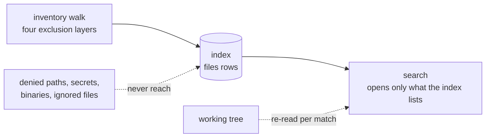

# Deterministic search

Search is the first retrieval feature the context engine answers with, and it is
deliberately the least clever one. It finds every occurrence of a literal, a
regular expression, or a path substring, in an order that does not move, with
everything it left out written into the answer. There is no scoring, no
embedding, no fuzzy matching, and no subprocess.

That is ADR-0005's bet stated as a feature: **a deterministic layer that can be
tested is worth more than a probabilistic one that can only be demonstrated.**
Two runs of one query over an unchanged repository return the same matches in
the same order, which is what makes retrieval quality something [#137] can
measure and [#121]'s ranking something that can be shown to have improved.

`harkness-context`'s `search` module is the implementation and its `//!`
documentation is the contract; `AGENTS.md`'s "Context Search Invariants" is the
normative list of what may not change. This document is the reference: what a
query can ask, what an answer holds, and what each refusal means.

## The universe is the index

Every file a scan opens came out of a `files` row in the [context
index](context-index.md), and every row came out of an [inventory
walk](context-inventory.md) whose four exclusion layers had already decided what
Harkness may read at all.

That ordering is the whole security story. A denied path, a `secret_sensitive`
file, a binary and an ignored file are **not rows waiting to be filtered out** —
they are rows that were never written, because the walk refused them before
anything derived from them. There is therefore no post-filter here that a later
change could forget to apply, and no code path where forgetting one would leak a
credential.



It has one consequence a caller must handle: **a worktree the index has never
seen is a refusal, not an empty answer.** `index_unavailable` says "I did not
look"; an empty `matches` list says "there is nothing there". Collapsing the two
would make a cold index indistinguishable from a repository that does not
contain the pattern, so search never falls back to walking the filesystem
itself.

Search re-reads file content from the working tree, because the index holds
paths, digests, ranges and names and never text. A file that moved since it was
indexed is searched **as it is now**, and the answer says so.

## What a query asks

| Part | Shape | Default |
| --- | --- | --- |
| pattern | `Exact(text)`, `Regex(pattern)`, or `Filename(text)` | — |
| path prefixes | repository-relative directories | the whole worktree |
| classes | a set of `FileClass` values | every eligible class |
| max results | matches per page | 200, capped at 1,000 |
| max bytes | match text per page | 256 KiB, capped at 8 MiB |
| context lines | lines either side of a match | 0, capped at 5 |
| max line bytes | one line of an excerpt | 8 KiB, capped at 64 KiB |
| cursor | a previous page's continuation | none |

Limits are **clamped rather than refused**. A caller asking for ten thousand
results gets a thousand and a cursor; asking for zero gets the default. A query
that failed on a number would be a query every front end had to validate twice.
Every one of the four is *capped* as well as defaulted, because caller-supplied
numbers may not decide how much memory one response holds — a thousand matches
each carrying eleven megabyte-long lines is otherwise a single call away.

Path prefixes narrow and can never widen: they are compared against stored path
bytes and never reach the filesystem. Containment requires the separator, so
`src` covers `src` and `src/main.rs` and never `src-generated.rs`. A prefix that
is absolute, or that leaves the worktree through `..`, is refused with
`forbidden_path` — not because it could reach anything, but because answering it
would teach a caller that such a path is expressible here.

Prefixes are normalized as they are added: naming one directory twice, or naming
one another already covers, adds nothing. Past 64 **distinct subtrees** the query
is refused with `too_many_filters` — deliberately not `forbidden_path`, because
a size limit and a path outside the workspace lead a front end to say opposite
things.

### A regular expression is a capability

`Exact` escapes every metacharacter, so `a.b` finds `a.b` and never `axb`.
Nothing a caller writes is interpreted, which is why the exact shape needs no
permission at all.

`Regex` runs a small program a caller supplied over the repository's content.
That is a policy decision rather than an engine one, so the engine refuses with
`regex_not_permitted` unless the query carries the capability in as many words:

```rust
let query = SearchQuery::regex(r"fn \w+_handler").permitting_regex();
```

`harkness-context` cannot see the policy engine — it sits above this crate — so
what is here is the seam that makes the decision have to be made. [#123] is what
calls `permitting_regex`, and only after [#91]'s policy said so.

Patterns are compiled by the linear-time engine, so there is no backtracking to
blow up, and three things are refused at compile time before any file is opened:
a pattern past the 10 MiB compiled-size limit, a pattern that could match a line
terminator (a line-oriented scan may not be handed one that is not
line-oriented), and a pattern containing a NUL (binary detection stops at one, so
such a pattern could only ever match content the scan will not reach).

## What an answer holds

```
SearchResponse
├── query_id, snapshot_id      the call
├── index_generation           the universe
├── matches[]                  the answer, in canonical order
├── omissions[], dropped_omissions   everything left out
├── next_cursor                where to continue, when a budget fired
└── stats                      paths examined, files scanned, bytes read
```

The first two name the **call** and everything else names the **answer**. Two
runs of one query over an unchanged worktree produce one answer and two captures
— the same distinction a `SnapshotId` draws everywhere else in the engine, where
capturing one unchanged workspace twice yields two ids and one digest.

### Ordering is a total order over positions

Matches sort by canonical **path bytes** ascending, then by absolute **byte
offset** ascending. Nothing else ever decides, and there is no sort whose
stability could: the index yields rows in path order and a file is scanned front
to back, so matches arrive already ordered.

A content match is reported **once per matching line**, positioned at the first
occurrence on that line. That is what makes the pair unique — two matches sharing
a position would be two matches no cursor could sit between — and it is why a
line holding three occurrences costs one result rather than three.

### A cursor is a position, not an offset

"Skip the first N matches" is a different set of matches every time the
repository moves. "The first match after this one" is well defined however the
surrounding results changed, and that is what `SearchCursor` holds. It is
opaque, versioned, and bound to two things it refuses rather than guesses at:

| Refusal | Means | Repair |
| --- | --- | --- |
| `malformed` | not a token this build mints | run the query again |
| `generation_changed` | the index was rebuilt or disposed | run the query again |
| `different_query` | the token belongs to another query | run that query, or this one from the start |

All three arrive as `stale_search_cursor`, because all three lead to the same
repair. The distinction is carried in the refusal rather than published as three
kinds a caller would handle identically.

A continuation reads index rows strictly after the cursor's path and fetches
that path's own row by name, because a page may have stopped in the middle of a
file and the rest of that file is the next page's first matches.

### Truncation is part of the answer

Every bound that fires puts an omission in the **success** payload:

| Omission | Fires when |
| --- | --- |
| `result_budget_exhausted` | the page filled and there was more |
| `byte_budget_exhausted` | the page's match text filled and there was more |
| `line_too_long` | the matched line **or one of its context lines** was longer than the per-line bound; the match is returned clamped and marked |
| `file_unreadable` | a file the index lists could not be opened |
| `file_changed_since_index` | a file's bytes are not the ones the index recorded; it was searched as it is now |
| `encoding_not_searchable` | a UTF-16 file, which this scan does not transcode |
| `binary_content_detected` | a NUL byte inside a file the index classified as text |

A result list stopped by a budget and a repository holding exactly that many
matches are otherwise one value, and reading the first as the second is how a
bounded search quietly becomes a wrong one.

The bound is checked against the **offered** match rather than the stored one,
which is what makes a full page distinguishable from a truncated one: a match
that does not fit is proof there was more, so a page that fills exactly and then
runs out carries no cursor and no omission. It is the same probe `IndexedPage`
uses on the read side of the index.

One rule bends deliberately: a byte budget smaller than a single match returns
that match anyway. The alternative is an empty page carrying a cursor that points
before the very match that did not fit, which the next call would answer the same
way — a caller paging politely forever over nothing.

Past 256 omissions the list stops and `dropped_omissions` counts the rest, which
is the bargain the inventory already makes with its diagnostics.

### Every match says where it came from

| Field | Answers |
| --- | --- |
| `path`, `byte_offset`, `line_number` | where |
| `line`, `before`, `after` | what, clamped and self-describing |
| `content_sha256` | the digest of the file version that was **searched**, absent for a filename match |
| `provenance.content_sha256` | the digest of the excerpt as **shown**, after any clamping |
| `provenance.source` | `lexical_search` or `filename_search` |
| `provenance.snapshot_id` | the workspace state it was read from |
| `provenance.range` | the matched line's byte range and line hints |

The two digests answer different questions and are deliberately not the same
value. A file that moved between indexing and reading is stamped with what it
**is**, not with what the index remembered, so provenance never names a version
nothing held.

Neither covers the context lines. `provenance.content_sha256` covers exactly the
region `provenance.range` names, which is the matched line; context lines sit
beside it as their own `BoundedText`s. A digest spanning them would describe a
region the range does not, and the range is what an edit is applied against.

Text is bounded and self-describing. Every excerpt is a `BoundedText` carrying
a `TextEncoding`: valid UTF-8 travels as itself, anything else travels Base64,
and a wire projection spells that pair `content_encoding: "utf8" | "base64"`,
following the convention the diff payload already publishes. A clamp walks back
off a multi-byte character rather than emitting half of one, and the encoding is
decided by the whole source rather than by the clamped prefix — otherwise a line
would flip from `utf8` to `base64` because of where a limit happened to fall.

## Filename search

`Filename` matches a substring of the repository-relative path, reads no file
content at all, and answers from the index's own rows. It is an order of
magnitude faster than a content query for that reason, and its matches carry
`filename_search` and no `content_sha256` — nothing was read, so there is no
file version to name. The excerpt shown is the path itself.

The same compiled engine decides what "contains" means for all three shapes. A
hand-rolled substring search over paths would be a second answer to one question,
and the two would be free to disagree about a pattern nobody thought to test.

## Cost, and where it goes

| Query | Medium profile (~10,000 eligible files) |
| --- | --- |
| content, exhaustive (matches nothing) | < 100 ms |
| content, stopped by the default result budget | a few milliseconds |
| filename | < 25 ms |

A content query costs about one file open and read per eligible file it has to
examine, so what it costs depends entirely on how early it stops. The exhaustive
case is the budgeted one because it is the one that cannot be gamed.

Both targets measure `ContextEngine::search_under`, which takes a capture the
caller already holds. `ContextEngine::search` captures one for you, and on a
repository of any size that capture costs several times what the scan does — so
a run that recorded a snapshot before it started work should pass that one in.
Not only for the time: a run that searched five times through the capturing
method would stamp its evidence with five workspace states for one moment.

## Refusals

| Kind | Means |
| --- | --- |
| `invalid_pattern` | empty, too long, will not compile, or compiles past its size limit |
| `regex_not_permitted` | a regular expression arrived without the capability |
| `forbidden_path` | a path filter is absolute or leaves the worktree |
| `too_many_filters` | the query narrows to more distinct subtrees than the merge streams |
| `stale_search_cursor` | a continuation cannot be used; see the table above |
| `index_unavailable` | the worktree has no index — build one |
| `cancelled` | the token was observed; no partial page is returned |

Every one of these is decided **before the workspace capture**, not only before
the first file is opened. A capture reads the whole worktree and costs several
times what the scan does, so a query that cannot run must not pay for one — and
left the other way round it would be an amplification lever: repeating a
refusable query would drive an unbounded number of full workspace reads for an
answer that was never going to change.

A cancelled search yields **no** partial response. A caller that stopped one did
not ask for the prefix of an answer, and a partial page under the same shape as a
complete one is how a bounded result becomes a wrong one.

## Why there is no subprocess

The ripgrep libraries run in process. Shelling out to `rg` would put a
caller-supplied pattern on an argv, and the defence against that is a quoting
rule somebody has to keep getting right forever. There is no argv here, so there
is nothing to escape from — the same reasoning `harkness-git`'s runner applies to
Git, reached by removing the process rather than by hardening it.

ADR-0005 records the alternative that was refused, and the trade it accepts.

## What is not here

- **Ranking and scoring** are [#121]. Matches come back in canonical order and
  the engine expresses no opinion about which is better.
- **A language filter** is absent rather than accepted-and-ignored. Nothing in
  this build populates a language — that vocabulary belongs to [#117]'s parser
  adapters — and a filter over a column no row carries would answer "no match"
  for a repository full of matches.
- **Symbol-aware lookup** is [#117], the **repository map** is [#118], and the
  **tool and policy wiring** that exposes any of this to a model is [#123].
- **UTF-16 content** is reported rather than searched. Byte offsets are what
  provenance and every later edit are anchored to, and a transcoding scan would
  report positions in a decoded stream nothing on disk holds.

## What proves this

| Claim | Package | Test |
| --- | --- | --- |
| Two runs over an unchanged worktree agree | `harkness-context` | `search::tests::two_runs_of_one_query_over_an_unchanged_worktree_agree` |
| Ordering is path bytes then byte offset | `harkness-context` | `search::tests::matches_are_ordered_by_path_bytes_then_byte_offset` |
| Several prefixes merge into one global order | `harkness-context` | `search::tests::several_prefixes_merge_into_one_global_path_order` |
| Prefixes are normalized into a disjoint set | `harkness-context` | `search::tests::prefixes_are_normalized_into_a_sorted_disjoint_set` |
| A child prefix is dropped past a sibling sorting between | `harkness-context` | `search::tests::a_child_prefix_is_dropped_even_when_a_sibling_sorts_between_it_and_its_parent` |
| Overlapping prefixes never report one file twice | `harkness-context` | `search::tests::overlapping_prefixes_never_report_one_file_twice` |
| More subtrees than the merge streams is its own refusal | `harkness-context` | `search::tests::a_query_may_not_name_more_subtrees_than_the_merge_holds` |
| Paging is exactly the unpaged answer | `harkness-context` | `search::tests::paging_yields_exactly_the_unpaged_answer_at_every_page_size` |
| Paging a filename query is exactly the unpaged answer | `harkness-context` | `search::tests::paging_a_filename_query_yields_exactly_the_unpaged_answer` |
| A page that fills exactly is complete | `harkness-context` | `search::tests::a_page_that_fills_exactly_carries_no_cursor` |
| A result budget hands back a usable cursor | `harkness-context` | `search::tests::a_result_budget_reports_itself_and_hands_back_a_usable_cursor` |
| A byte budget stops at the boundary | `harkness-context` | `search::tests::a_byte_budget_reports_itself_and_stops_at_the_boundary` |
| A budget smaller than one match still answers | `harkness-context` | `search::tests::a_budget_smaller_than_one_match_returns_that_match_anyway` |
| A full omission list keeps the truncation notice | `harkness-context` | `search::tests::a_full_omission_list_never_swallows_the_truncation_notice` |
| A rebuilt index refuses an old cursor | `harkness-context` | `search::tests::a_cursor_from_a_rebuilt_index_is_refused_rather_than_mixed` |
| A cursor cannot be replayed against another query | `harkness-context` | `search::tests::a_cursor_replayed_against_a_different_query_is_refused` |
| A cursor round-trips through its token | `harkness-context` | `search::tests::a_cursor_round_trips_through_its_opaque_token` |
| A foreign token is refused as malformed | `harkness-context` | `search::tests::a_token_this_build_did_not_mint_is_refused_as_malformed` |
| Secret, ignored and binary files can never match | `harkness-context` | `search::tests::a_secret_an_ignored_and_a_binary_file_can_never_match` |
| A symlink out of the workspace is never searched | `harkness-context` | `search::tests::a_symlink_pointing_outside_the_workspace_is_never_searched` |
| A path filter is refused outside the workspace | `harkness-context` | `search::tests::a_prefix_leaving_the_workspace_is_refused_by_name` |
| A path filter never reaches a sibling prefix | `harkness-context` | `search::tests::a_path_filter_never_reaches_a_sibling_it_is_a_prefix_of` |
| A class filter admits only what it names | `harkness-context` | `search::tests::a_class_filter_admits_only_the_classes_it_names` |
| Regex needs the capability | `harkness-context` | `search::tests::a_regex_query_is_refused_without_the_capability_and_runs_with_it` |
| An exact pattern is literal | `harkness-context` | `search::tests::an_exact_pattern_matches_its_metacharacters_literally` |
| An unrunnable pattern is refused before any I/O | `harkness-context` | `search::tests::a_pattern_that_cannot_be_run_is_refused_before_a_file_is_opened` |
| A refusable query never reaches the capture | `harkness-context` | `search::tests::a_refusable_query_never_reaches_the_capture` |
| An unindexed worktree is refused before the capture | `harkness-context` | `search::tests::an_unindexed_worktree_is_refused_before_the_capture` |
| A refusal explains itself | `harkness-context` | `search::tests::an_invalid_pattern_refusal_explains_itself` |
| Limits are clamped rather than refused | `harkness-context` | `search::tests::limits_are_clamped_rather_than_refused` |
| No caller-supplied bound exceeds its cap | `harkness-context` | `search::tests::no_caller_supplied_bound_can_exceed_its_published_cap` |
| A long line is clamped and reported | `harkness-context` | `search::tests::a_long_line_is_clamped_and_the_omission_says_which_position` |
| A clamped context line reports itself | `harkness-context` | `search::tests::a_clamped_context_line_reports_itself_even_when_the_match_line_fits` |
| Non-UTF-8 content is Base64 and exact | `harkness-context` | `search::tests::non_utf8_match_content_is_base64_and_reconstructs_the_exact_bytes` |
| A non-UTF-8 path carries its exact bytes | `harkness-context` | `search::tests::a_filename_match_on_a_path_that_is_not_utf8_carries_its_exact_bytes` |
| Bounded text never cuts a character in half | `harkness-context` | `search::tests::bounded_text_round_trips_and_never_cuts_a_character_in_half` |
| UTF-16 is reported rather than silently unsearched | `harkness-context` | `search::tests::a_utf16_file_is_reported_rather_than_silently_unsearched` |
| A moved file is searched as it is and says so | `harkness-context` | `search::tests::a_file_that_moved_since_indexing_is_searched_as_it_is_and_says_so` |
| A deleted file is reported and the scan continues | `harkness-context` | `search::tests::a_file_deleted_since_indexing_is_reported_and_the_scan_continues` |
| Context lines come from the file and stop at its edges | `harkness-context` | `search::tests::context_lines_come_from_the_file_and_stop_at_its_edges` |
| Every match carries usable provenance | `harkness-context` | `search::tests::every_match_carries_the_provenance_a_later_reader_needs` |
| A filename match reads no content | `harkness-context` | `search::tests::a_filename_match_reads_no_content_and_is_attributed_to_the_path_search` |
| An empty result is a success with no omissions | `harkness-context` | `search::tests::an_empty_result_is_a_success_with_no_omissions` |
| A held capture answers exactly as a taken one | `harkness-context` | `search::tests::a_search_under_a_held_capture_answers_exactly_as_one_that_takes_its_own` |
| A capture of another checkout is refused | `harkness-context` | `search::tests::a_capture_of_another_checkout_is_refused_rather_than_stamped_onto_results` |
| Cancellation yields no partial page | `harkness-context` | `search::tests::a_cancelled_search_yields_no_partial_page` |
| `SearchError::KINDS` is exact | `harkness-context` | `search::tests::every_search_variant_maps_to_a_listed_kind_in_declaration_order` |
| `SearchOmission::KINDS` is exact | `harkness-context` | `search::tests::every_omission_variant_maps_to_a_listed_kind_in_declaration_order` |
| A cursor is bound to what decides its matches | `harkness-context` | `search::tests::a_query_identity_covers_what_decides_its_matches_and_not_its_page_size` |
| A search refusal keeps its own discriminant | `harkness-context` | `error::tests::a_carried_search_refusal_keeps_its_own_kind_but_not_its_own_cancellation` |
| An unindexed worktree refuses rather than answers | `harkness-context` | `searching_an_unindexed_worktree_refuses_rather_than_answering_empty` |
| The whole surface works from outside the crate | `harkness-context` | `search_answers_paged_attributed_matches_from_outside_the_crate` |

## Where to read next

- [`docs/adr/0005-deterministic-retrieval-first.md`](adr/0005-deterministic-retrieval-first.md)
  — why deterministic retrieval comes first, and what that costs.
- [`docs/context-index.md`](context-index.md) — the cache this reads its
  universe from, and what a generation change invalidates.
- [`docs/context-inventory.md`](context-inventory.md) — the walk that decides
  what can be searched at all.
- [`docs/architecture-context.md`](architecture-context.md) — the pipeline this
  sits in.

[#91]: https://github.com/fullstacktaiye/harkness/issues/91
[#117]: https://github.com/fullstacktaiye/harkness/issues/117
[#118]: https://github.com/fullstacktaiye/harkness/issues/118
[#121]: https://github.com/fullstacktaiye/harkness/issues/121
[#123]: https://github.com/fullstacktaiye/harkness/issues/123
[#137]: https://github.com/fullstacktaiye/harkness/issues/137
